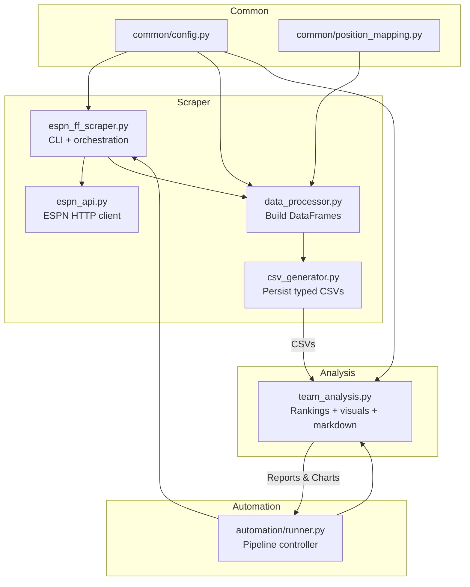

# ESPN Fantasy Football Scraper & Analyzer

## Overview
A comprehensive ESPN Fantasy Football data scraper and analysis tool that downloads historical league data, generates advanced statistical visualizations, and sends weekly email recaps with AI-generated commentary.

**Current Status**: Fully functional with 2025 season data (weeks 1-14 processed)

## Features
- **Data Scraping**: Pulls matchups, player stats, and team stats from ESPN's API
- **Power Rankings**: Custom ranking system using Real Wins, Top6 Wins, and MVP-W
- **WAX (Wins Above Expectation)**: Luck analysis showing who's running hot/cold
- **Visualizations**: 9 charts including power rankings, weekly trends, and heatmaps
- **AI Commentary**: Personalized, snarky weekly recaps for each team using OpenAI
- **SkatteBot**: Your frat bro email host who summarizes the week's action
- **PDF Reports**: Professional PDF with embedded charts
- **Email Delivery**: Sends weekly results + PDF report to your inbox

## Required Secrets

Add these under the **Secrets** tab (lock icon in the sidebar):

| Key | Required | Purpose |
| --- | --- | --- |
| `ESPN_S2` | Private leagues only | ESPN auth cookie (long string) |
| `SWID` | Private leagues only | ESPN auth cookie with braces |
| `LEAGUE_ID` | Yes | Your ESPN league ID number |
| `YEARS` | Yes | Season year (e.g., `2025`) |
| `EMAIL_FROM` | For email | Your sending email address |
| `EMAIL_TO` | For email | Recipient email(s), comma-separated |
| `SMTP_HOST` | For email | SMTP server (e.g., `smtp.gmail.com`) |
| `SMTP_PORT` | For email | Usually `587` |
| `SMTP_USERNAME` | For email | Your email login |
| `SMTP_PASSWORD` | For email | Your email password or app password |

**How to capture ESPN cookies:**
1. Log in to https://fantasy.espn.com and load your league page.
2. Open browser dev tools (`F12`) -> Application/Storage tab.
3. Expand **Cookies -> https://fantasy.espn.com**.
4. Copy the values for `espn_s2` and `SWID` (keep the braces).
5. Store them as `ESPN_S2` and `SWID` secrets (never commit these values).

The AI commentary uses Replit's built-in OpenAI integration - no additional API keys needed.

## How to Run

### Using the Run Button
Click the **Run** button to execute the full pipeline:
1. Scrapes ESPN data into `data/latest/`
2. Generates reports and charts in `reports/latest/`
3. Archives everything under `archive/<timestamp>/`
4. Sends email with week results, PDF report, and CSV summary

### Using the Shell
For manual runs or testing:
```bash
python -m src.automation.runner --league-id YOUR_LEAGUE_ID --years 2025 --verbose
```

## Setting Up Automatic Weekly Runs

To have this run automatically every week (like every Tuesday morning):

1. Click **Deploy** in the top menu
2. Choose **Scheduled** deployment type
3. Set the command: `python -m src.automation.runner --league-id YOUR_LEAGUE_ID --years 2025`
4. Pick your schedule (e.g., "Every Tuesday at 8:00 AM")
5. Copy your secrets to the deployment environment
6. Click **Deploy**

The scheduled deployment will automatically run the pipeline at your chosen time and send the email recap.

## What the Email Contains

**In the email body:**
- SkatteBot's frat-bro summary of the week's action
- Week number
- This week's 5 matchup results (winner, loser, scores)

**Attached:**
- PDF report with power rankings, charts, and AI commentary for each team
- CSV summary of all team stats

## Output Files

All CSVs include a `season` column so you can combine multiple years safely.
- `matchups.csv`: week-by-week matchups including opponent, score, and result.
- `player_stats.csv`: per-player scoring with slot/position labels.
- `team_stats.csv`: team totals plus advanced metrics (weekly rank, Top6 wins, MVP-W, WAX inputs).
- `team_summary.csv`: rollup used for power rankings and newsletter narrative.

## Power Rankings & Visualizations

The analysis produces the following charts on each run:
1. `power_rankings.png` - leaderboard sorted by power score
2. `power_breakdown.png` - stacked bars of Real Wins, Top6 Wins, MVP-W
3. `power_rankings_evolution.png` - line chart for weekly ranking shifts
4. `wax_leaderboard.png` - Wins Above Expectation comparison
5. `wins_vs_expected.png` - scatter of real vs expected wins
6. `total_points.png` - season-long points for each team
7. `weekly_performance.png` - trends of weekly scoring
8. `weekly_rank_heatmap.png` - heatmap of weekly ranks
9. `consistency.png` - variation in scoring week over week
10. `power_rankings_analysis.md` - narrative report with snark + embedded charts

## Troubleshooting

- **403 errors**: ESPN cookies (`ESPN_S2`/`SWID`) are missing or expired. Get fresh ones from your browser.
- **No email sent**: Check that all email settings are configured in Secrets.
- **Missing data**: The runner clears `data/latest/` each run. Historical data is in `archive/`.
- **No charts**: Verify `team_stats.csv` exists in `data/latest/` before running the analysis step.

## Key Metrics

- **Power Score** = (Real Wins x 2) + Top6 Wins + MVP-W
- **MVP-W** = Theoretical wins if you played every team each week
- **WAX** = Real Wins - MVP-W (positive = lucky, negative = unlucky)

## Project Structure
```
src/
├── common/
│   ├── config.py              - shared constants, defaults, CSV names
│   └── position_mapping.py    - slot/position maps for ESPN IDs
├── scraper/
│   ├── espn_ff_scraper.py     - CLI + scrape_league helper
│   ├── espn_api.py            - ESPN HTTP client
│   ├── data_processor.py      - dataframe builders
│   └── csv_generator.py       - type-safe CSV writer
├── analysis/
│   └── team_analysis.py       - power rankings, charts, AI commentary
└── automation/
    └── runner.py              - scrape -> analyze -> archive -> email

data/latest/                   - Most recent scraped data
reports/latest/                - Most recent generated reports
archive/                       - Historical runs by timestamp
```

## Architecture Flowchart



## Privacy & Security
- Never commit secrets; store them in Replit's secret manager.
- ESPN cookies expire periodically - treat them like passwords and rotate when scraping fails.
- Archives may contain sensitive matchup data; share them carefully.
