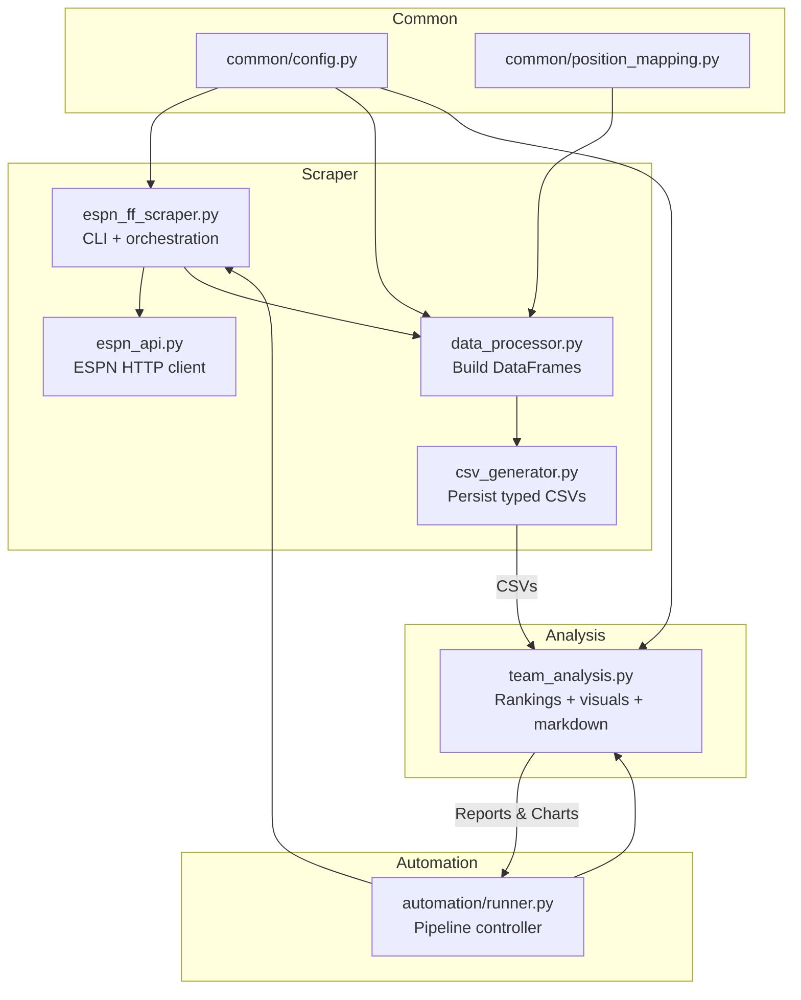

# ESPN Fantasy Football Scraper & Newsletter

An end-to-end toolkit that scrapes ESPN Fantasy Football data, builds power-ranking visualizations, archives weekly artifacts, and emails a Tuesday-morning recap. The core logic now lives inside the `src/` package so it can be reused locally, on Replit, or in any scheduled worker.

## Feature Highlights
- Multi-season scraping with automatic filtering of unplayed weeks.
- Analysis pipeline that creates `team_summary.csv`, a snarky markdown newsletter, and nine Matplotlib/Seaborn visuals.
- Automation runner (`src/automation/runner.py`) that orchestrates scrape → analysis → archiving → email.
- Directory hygiene: latest outputs live in `data/latest/` and `reports/latest/`; immutable snapshots are stored under `archive/<timestamp>/`.
- SMTP notifications with attachments so the recap lands in your inbox without pulling files manually.

## Quick Start

### Manual scrape + analysis
```bash
python -m src.scraper.espn_ff_scraper --league_id YOUR_LEAGUE_ID --years 2024 2025 --output ./data/latest
python -m src.analysis.team_analysis ./data/latest/team_stats.csv ./reports/latest
```
- CSVs land in `data/latest/`.
- Markdown + PNGs land in `reports/latest/`.
- Copy both folders somewhere safe if you want historical snapshots.

### One-shot automation + email
```bash
python -m src.automation.runner --league-id YOUR_LEAGUE_ID --years 2024 2025 --verbose
```
The runner wipes yesterday's artifacts, runs the scraper + analysis, archives the results, and emails the summary CSV + markdown newsletter whenever SMTP secrets are set.

### Artifact directories
- `data/latest/`: fresh CSV exports (`matchups.csv`, `player_stats.csv`, `team_stats.csv`).
- `reports/latest/`: `team_summary.csv`, `power_rankings_analysis.md`, and charts.
- `archive/<timestamp>/`: timestamped copy of both folders for future reference.

## Secrets & Environment

| Key | Required | Purpose |
| --- | --- | --- |
| `ESPN_S2` | Private leagues | ESPN auth cookie (long string) |
| `SWID` | Private leagues | ESPN auth cookie with braces |
| `EMAIL_FROM` | Optional | Sender address for recap email |
| `EMAIL_TO` | Optional | Comma-separated recipients |
| `SMTP_HOST` / `SMTP_PORT` | Optional | Mail server + port (default 587) |
| `SMTP_USERNAME` / `SMTP_PASSWORD` | Optional | SMTP credentials |
| `LEAGUE_ID`, `YEARS` | Optional | Helpful for scheduled deployments (see `.replit`) |

**How to capture ESPN cookies**
1. Log in to https://fantasy.espn.com and load your league page.
2. Open browser dev tools (`F12`) → Application/Storage tab.
3. Expand **Cookies → https://fantasy.espn.com**.
4. Copy the values for `espn_s2` and `SWID` (keep the braces).
5. Store them as `ESPN_S2` and `SWID` secrets (never commit these values).

## Project Architecture
```
src/
├─ common/
│  ├─ config.py              # shared constants, defaults, CSV names
│  └─ position_mapping.py    # slot/position maps for ESPN IDs
├─ scraper/
│  ├─ espn_ff_scraper.py     # CLI + scrape_league helper
│  ├─ espn_api.py            # ESPN HTTP client
│  ├─ data_processor.py      # dataframe builders
│  └─ csv_generator.py       # type-safe CSV writer
├─ analysis/
│  └─ team_analysis.py       # power rankings, charts, markdown
└─ automation/
   └─ runner.py              # scrape → analyze → archive → email
```
Supporting folders:
- `data/`, `reports/`, `archive/`: contain generated artifacts (git-ignored except for `.gitkeep`).
- `visualizations/`: checked-in gallery for reference.

## Workflow Details
1. **Scrape data** (manual): `python -m src.scraper.espn_ff_scraper --league_id ... --years ...`.
2. **Analyze data**: `python -m src.analysis.team_analysis ./data/latest/team_stats.csv ./reports/latest`.
3. **Automate everything**: `python -m src.automation.runner --league-id ... --years ...`.
4. **Email recap**: provide SMTP + email env vars so the runner can send attachments (`team_summary.csv` + `power_rankings_analysis.md`).
5. **Archive**: every automation run copies `data/latest/` and `reports/latest/` into `archive/<UTC timestamp>/` for long-term storage.

## Power Rankings & Visualizations
`team_analysis.py` produces the following assets on each run:
1. `power_rankings.png` — leaderboard sorted by power score.
2. `power_breakdown.png` — stacked bars of Real Wins, Top6 Wins, MVP-W.
3. `power_rankings_evolution.png` — line chart for weekly ranking shifts.
4. `wax_leaderboard.png` — Wins Above Expectation comparison.
5. `wins_vs_expected.png` — scatter of real vs expected wins.
6. `total_points.png` — season-long points for each team.
7. `weekly_performance.png` — trends of weekly scoring.
8. `weekly_rank_heatmap.png` — heatmap of weekly ranks.
9. `consistency.png` — variation in scoring week over week.
10. `power_rankings_analysis.md` — narrative report with snark + embedded charts.

## Command Reference

### Scraper (`src.scraper.espn_ff_scraper`)
| Option | Description | Required | Default |
| --- | --- | --- | --- |
| `--league_id` | ESPN Fantasy Football League ID | Yes | — |
| `--years` | One or more seasons to fetch | No | current season |
| `--week` | Specific week (otherwise all played weeks) | No | All |
| `--output` | Output directory for CSVs | No | `.` |

### Automation runner (`src.automation.runner`)
| Option | Description | Required | Default |
| --- | --- | --- | --- |
| `--league-id` | ESPN league ID | Yes | — |
| `--years` | Season list | No | current season |
| `--week` | Limit to a single week | No | all played weeks |
| `--email-to` / `--email-from` | Override email env vars | No | env |
| `--smtp-host` / `--smtp-port` | Override SMTP env vars | No | env/587 |
| `--smtp-username` / `--smtp-password` | SMTP credentials | No | env |
| `--smtp-disable-tls` | Use SSL instead of STARTTLS | No | STARTTLS |
| `--verbose` | Debug logging | No | info |

## Output Files
All CSVs include a `season` column so you can combine multiple years safely.
- `matchups.csv`: week-by-week matchups including opponent, score, and result.
- `player_stats.csv`: per-player scoring with slot/position labels.
- `team_stats.csv`: team totals plus advanced metrics (weekly rank, Top6 wins, MVP-W, WAX inputs).
- `team_summary.csv`: rollup used for power rankings and newsletter narrative.

## Automation & Hosting
- `.replit` runs `python -m src.automation.runner` by default so the Run button performs the full pipeline.
- `replit.md` details how to add secrets, override args, and schedule weekly runs with Replit Deployments.

## Troubleshooting
- **403 Forbidden**: ESPN cookies missing or expired. Refresh `ESPN_S2` and `SWID`.
- **Invalid league ID**: double-check the numeric ID in the league URL and ensure you have access for each requested season.
- **No email**: confirm SMTP host/credentials plus `EMAIL_FROM`/`EMAIL_TO`. Run with `--verbose` for SMTP logs.
- **No charts**: verify `team_stats.csv` exists in `data/latest/` before running the analysis step.

## Privacy & Security
- Never commit secrets; store them in Replit/Vercel/your host's secret manager.
- ESPN cookies expire periodically—treat them like passwords and rotate when scraping fails.
- Archives may contain sensitive matchup data; share them carefully.

## Git + GitHub Workflow
1. `git init && git add . && git commit -m "Initial import"`.
2. Create a GitHub repo, then:
   ```bash
   git branch -M main
   git remote add origin https://github.com/<user>/<repo>.git
   git push -u origin main
   ```
3. Use feature branches for enhancements and keep generated artifacts out of version control (already handled via `.gitignore`).
## Replit Setup
1. Import this repo into a Python Replit and open the Shell.
2. Run `pip install -r requirements.txt` once (or let the `.replit` hook do it automatically on first run).
3. Add the required secrets under **Tools → Secrets** (`ESPN_S2`, `SWID`, optional SMTP keys).
4. Hit **Run**—Replit executes `python -m src.automation.runner` per `.replit`, generating fresh data, reports, and archive snapshots.
5. For custom flags, stop the default run and execute the desired CLI command in the Shell.

## src Modules at a Glance
| Folder | Responsibility | Typical Consumers |
| --- | --- | --- |
| `common/` | Shared config values, ID/position maps | All downstream code |
| `scraper/` | HTTP calls, parsing, CSV emission | Automation runner, manual scrape |
| `analysis/` | Power-ranking math, charts, newsletter | Automation runner, manual analysis |
| `automation/` | Orchestrates scrape → analyze → archive → email | Replit/cron jobs |


