# DU Alums 2025 Fantasy Football Power Rankings
## Week 14 Update - Generated December 12, 2025 at 03:30 AM

---

## Week 15 Playoff Scenarios
### Current Standings (After Week 14)
| Seed | Team | Record | Points For | Playoff % |
|------|------|--------|------------|----------|
| 1 | **ZSF** | 9-5 | 1656.28 | 90.7% |
| 2 | **MP** | 9-5 | 1587.82 | 91.0% |
| 3 | **sgf** | 9-5 | 1526.08 | 64.6% |
| 4 | **KIRK** | 9-5 | 1524.90 | 87.3% |
| 5 | **GV** | 9-5 | 1485.96 | 63.9% |
| 6 | **POO** | 8-6 | 1471.46 | 2.5% |
| 7 | **GEMP** (ELIMINATED) | 7-7 | 1380.84 | 0.0% |
| 8 | **KESS** (ELIMINATED) | 6-8 | 1334.74 | 0.0% |
| 9 | **PATS** (ELIMINATED) | 5-9 | 1477.38 | 0.0% |
| 10 | **ROUX** (ELIMINATED) | 5-9 | 1319.44 | 0.0% |
| 11 | **3000** (ELIMINATED) | 4-10 | 1288.56 | 0.0% |
| 12 | **WOOD** (ELIMINATED) | 4-10 | 1229.16 | 0.0% |

### Week 15 Matchups (Final Week of Regular Season)
| Matchup | Favorite | Win Prob | Playoff Implications |
|---------|----------|----------|---------------------|
| WOOD vs ROUX | WOOD | 51% | No playoff impact |
| GEMP vs GV | GV | 63% | GV fighting for playoff spot |
| KESS vs PATS | PATS | 66% | No playoff impact |
| MP vs POO | MP | 52% | MP fighting for playoff spot; POO fighting for playoff spot |
| KIRK vs 3000 | KIRK | 76% | KIRK fighting for playoff spot |
| sgf vs ZSF | ZSF | 62% | sgf fighting for playoff spot; ZSF fighting for playoff spot |

### Playoff Probability by Seed
| Team | 1st Seed | 2nd Seed | 3rd Seed | 4th Seed | Total Playoff % |
|------|----------|----------|----------|----------|----------------|
| **MP** | 19.6% | 34.8% | 13.8% | 22.8% | **91.0%** |
| **ZSF** | 61.7% | 2.0% | 9.8% | 17.2% | **90.7%** |
| **KIRK** | 6.6% | 36.0% | 34.4% | 10.2% | **87.3%** |
| **sgf** | 11.9% | 18.9% | 10.2% | 23.7% | **64.6%** |
| **GV** | 0.2% | 8.3% | 31.5% | 23.8% | **63.9%** |
| **POO** | 0.0% | 0.0% | 0.2% | 2.3% | **2.5%** |

### Clinch/Elimination Scenarios

**ZSF** (Currently #1, 9-5):
- WIN and IN: Clinches playoff spot with a victory
- With a LOSS: 75.5% playoff probability (needs help)

**MP** (Currently #2, 9-5):
- WIN and IN: Clinches playoff spot with a victory
- With a LOSS: 81.3% playoff probability (needs help)

**sgf** (Currently #3, 9-5):
- WIN and IN: Clinches playoff spot with a victory
- With a LOSS: 43.0% playoff probability (needs help)

**KIRK** (Currently #4, 9-5):
- WIN and IN: Clinches playoff spot with a victory
- With a LOSS: 47.4% playoff probability (needs help)

**GV** (Currently #5, 9-5):
- WIN and IN: Clinches playoff spot with a victory
- With a LOSS: 1.7% playoff probability (needs help)

**POO** (Currently #6, 8-6):
- With a WIN: 5.1% playoff probability
- LOSE and OUT: Eliminated with a loss

### Week 15 Points For Tiebreaker Analysis
*Teams with lose-and-still-in scenarios need these margins to win PF tiebreakers.*

**ZSF** (Current PF: 1656.3) - Tiebreaker Margins:

| Opponent | Their PF | Gap | Margin ZSF Needs |
|----------|----------|-----|------------------------|
| MP | 1587.8 | 68.5 ahead | Hold lead |
| sgf | 1526.1 | 130.2 ahead | Hold lead |
| KIRK | 1524.9 | 131.4 ahead | Hold lead |
| GV | 1486.0 | 170.3 ahead | Hold lead |
| POO | 1471.5 | 184.8 ahead | Hold lead |

**MP** (Current PF: 1587.8) - Tiebreaker Margins:

| Opponent | Their PF | Gap | Margin MP Needs |
|----------|----------|-----|------------------------|
| ZSF | 1656.3 | 68.5 behind | Outscore by **>68** |
| sgf | 1526.1 | 61.7 ahead | Hold lead |
| KIRK | 1524.9 | 62.9 ahead | Hold lead |
| GV | 1486.0 | 101.9 ahead | Hold lead |
| POO | 1471.5 | 116.4 ahead | Hold lead |

**sgf** (Current PF: 1526.1) - Tiebreaker Margins:

| Opponent | Their PF | Gap | Margin sgf Needs |
|----------|----------|-----|------------------------|
| ZSF | 1656.3 | 130.2 behind | Outscore by **>130** |
| MP | 1587.8 | 61.7 behind | Outscore by **>62** |
| KIRK | 1524.9 | 1.2 ahead | Hold lead |
| GV | 1486.0 | 40.1 ahead | Hold lead |
| POO | 1471.5 | 54.6 ahead | Hold lead |

**KIRK** (Current PF: 1524.9) - Tiebreaker Margins:

| Opponent | Their PF | Gap | Margin KIRK Needs |
|----------|----------|-----|------------------------|
| ZSF | 1656.3 | 131.4 behind | Outscore by **>131** |
| MP | 1587.8 | 62.9 behind | Outscore by **>63** |
| sgf | 1526.1 | 1.2 behind | Outscore by **>1** |
| GV | 1486.0 | 38.9 ahead | Hold lead |
| POO | 1471.5 | 53.4 ahead | Hold lead |

**GV** (Current PF: 1486.0) - Tiebreaker Margins:

| Opponent | Their PF | Gap | Margin GV Needs |
|----------|----------|-----|------------------------|
| ZSF | 1656.3 | 170.3 behind | Outscore by **>170** |
| MP | 1587.8 | 101.9 behind | Outscore by **>102** |
| sgf | 1526.1 | 40.1 behind | Outscore by **>40** |
| KIRK | 1524.9 | 38.9 behind | Outscore by **>39** |
| POO | 1471.5 | 14.5 ahead | Hold lead |


### Complete Week 15 Decision Tree (64 Outcomes)
*All possible matchup combinations leading to playoff outcomes.*


```mermaid
flowchart LR
    subgraph MATCHUPS["Week 15 Matchups"]
        M0["WOOD vs ROUX"]
        M1["GEMP vs GV"]
        M2["KESS vs PATS"]
        M3["MP vs POO"]
        M4["KIRK vs 3000"]
        M5["sgf vs ZSF"]
    end

    subgraph OUTCOMES["Playoff Outcomes"]
        O0["KIRK, MP, ZSF, sgf<br/>36.7% (32 paths)"]
        O1["GV, KIRK, MP, ZSF<br/>29.7% (8 paths)"]
        O2["GV, MP, ZSF, sgf<br/>15.3% (16 paths)"]
        O3["GV, KIRK, MP, sgf<br/>9.5% (4 paths)"]
        O4["GV, KIRK, ZSF, sgf<br/>8.8% (4 paths)"]
    end

    MATCHUPS --> OUTCOMES

    style O0 fill:#F0AB00,color:#000
    style O1 fill:#F0AB00,color:#000
    style O2 fill:#F0AB00,color:#000
    style O3 fill:#F0AB00,color:#000
    style O4 fill:#F0AB00,color:#000
    style MATCHUPS fill:#0d2137,color:#fff
    style OUTCOMES fill:#0a1628,color:#fff
```

### Tiebreaker Margin Requirements by Outcome

| Outcome | 4th Seed | 5th Place | PF Margin |
|---------|----------|-----------|----------|
| KIRK, MP, ZSF, sgf (36.7%) | ZSF | GV | +182.5 |
| GV, MP, ZSF, sgf (15.3%) | ZSF | KIRK | +140.8 |
| GV, KIRK, ZSF, sgf (8.8%) | ZSF | MP | +73.3 |

### Scenario Details (Top 8 Most Likely)

**Scenario 1** (5.2%):
- WOOD beats ROUX
- GV beats GEMP
- PATS beats KESS
- MP beats POO
- KIRK beats 3000
- ZSF beats sgf
- **Playoffs:** GV, KIRK, MP, ZSF

**Scenario 2** (5.1%):
- ROUX beats WOOD
- GV beats GEMP
- PATS beats KESS
- MP beats POO
- KIRK beats 3000
- ZSF beats sgf
- **Playoffs:** GV, KIRK, MP, ZSF

**Scenario 3** (4.8%):
- WOOD beats ROUX
- GV beats GEMP
- PATS beats KESS
- POO beats MP
- KIRK beats 3000
- ZSF beats sgf
- **Playoffs:** GV, KIRK, MP, ZSF

**Scenario 4** (4.7%):
- ROUX beats WOOD
- GV beats GEMP
- PATS beats KESS
- POO beats MP
- KIRK beats 3000
- ZSF beats sgf
- **Playoffs:** GV, KIRK, MP, ZSF

**Scenario 5** (3.2%):
- WOOD beats ROUX
- GV beats GEMP
- PATS beats KESS
- MP beats POO
- KIRK beats 3000
- sgf beats ZSF
- **Playoffs:** GV, KIRK, MP, sgf

**Scenario 6** (3.1%):
- ROUX beats WOOD
- GV beats GEMP
- PATS beats KESS
- MP beats POO
- KIRK beats 3000
- sgf beats ZSF
- **Playoffs:** GV, KIRK, MP, sgf

**Scenario 7** (3.0%):
- WOOD beats ROUX
- GEMP beats GV
- PATS beats KESS
- MP beats POO
- KIRK beats 3000
- ZSF beats sgf
- **Playoffs:** KIRK, MP, ZSF, sgf

**Scenario 8** (3.0%):
- WOOD beats ROUX
- GV beats GEMP
- PATS beats KESS
- POO beats MP
- KIRK beats 3000
- sgf beats ZSF
- **Playoffs:** GV, KIRK, ZSF, sgf


---

## A Note on ESPN's "Projections" (Read This First)

Before we dive into the numbers, let's address the elephant in the room: **ESPN's projection system is fundamentally broken.**

Here's what ESPN does: They project points for your entire starting lineup, including players who are on BYE weeks. That's right - if Jonathan Taylor is on BYE and will score exactly **zero points** this week, ESPN still includes his 19-point projection in your team's total. This isn't a minor oversight; it's a fundamental failure to understand how fantasy football works.

**The result?** ESPN's "projected points" are systematically inflated garbage that will mislead you into thinking your team is performing better than it actually will. Every single week, across every single team, their projections include phantom points from players who literally cannot play.

### What We Do Instead

This analysis applies actual intelligence to the problem:

| Projection Type | What It Means |
|-----------------|---------------|
| **ESPN Raw** | ESPN's projection (includes BYE players who will score 0 - useless) |
| **Corrected Baseline** | ESPN Raw minus unavailable players (the realistic floor) |
| **Optimized** | Corrected + your best bench replacements (what a smart manager achieves) |
| **Monte Carlo Input** | 60% Optimized + 40% Historical PPG (our simulation uses this) |

**The key insight:** Our "Optimized" projection is always greater than or equal to the Corrected Baseline, because making smart lineup decisions always helps. But it's often *less* than ESPN's Raw projection - not because optimization hurts you, but because ESPN's number was bullshit to begin with.

When you see a matchup breakdown showing ESPN Raw at 103 but Optimized at 88, don't panic. The 88 is what you'll actually score. The 103 was a fantasy (pun intended) that included your BYE week player's imaginary contribution.

*This analysis corrects for ESPN's incompetence so you can make informed decisions. You're welcome.*

---

## Season Snapshot

| Metric | Value |
|--------|-------|
| Weeks Played | 14 |
| Games Remaining | 1 |
| Playoff Teams | 4 |
| Tiebreaker | **Points For** (Total Season Points) |
| Current Leader | **ZSF** (9-5) |
| Highest Scorer | **ZSF** (118.31 PPG) |
| Luckiest Team | **GEMP** (+1.45 WAX) |
| Unluckiest Team | **PATS** (-2.82 WAX) |

---

## Understanding the Metrics

### **Power Score** (The Overall Ranking)
```
Power Score = (Real Wins × 2) + (Top6 Wins) + (MVP-W)
```
This is our ultimate measure of team quality. It heavily weights **actual matchup wins** (multiplied by 2) because winning is what matters most. But it also rewards teams that consistently score in the top half (**Top6 Wins**) and would beat multiple opponents each week (**MVP-W**).

### **MVP-W** (Minimized Variance Potential Wins)
Your theoretical win rate if you played **all teams in the league every single week**. High scorers have high MVP-W; low scorers don't.

### **WAX** (Wins Above Expectation)
```
WAX = Real Wins - MVP-W
```
- **Positive WAX** = Lucky (winning more than scoring deserves)
- **Negative WAX** = Unlucky (losing despite good scoring)
- **WAX near 0** = Getting exactly what you deserve

---

## Overall Power Rankings

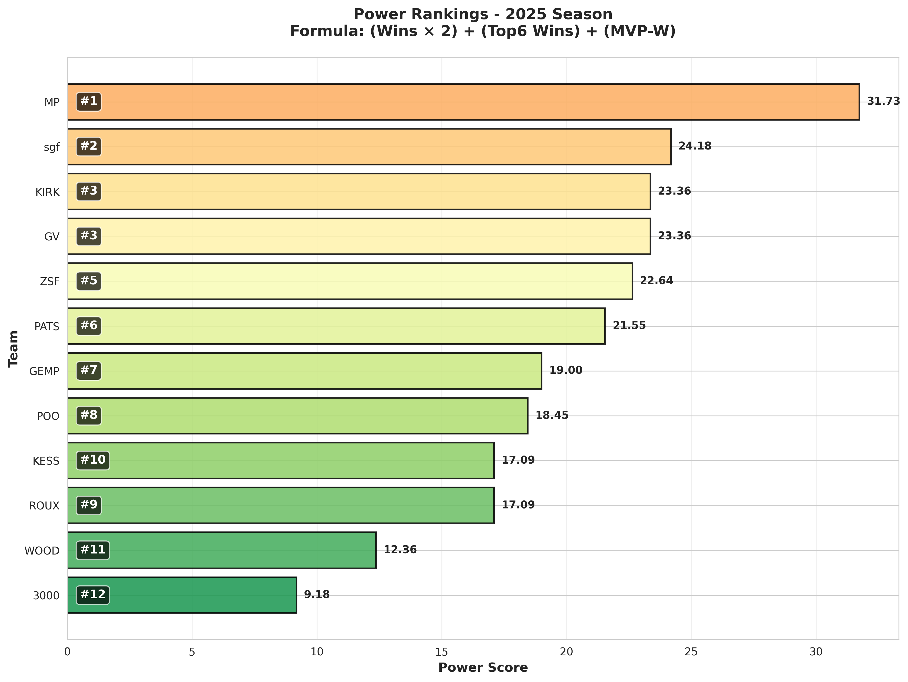

## Power Score Breakdown

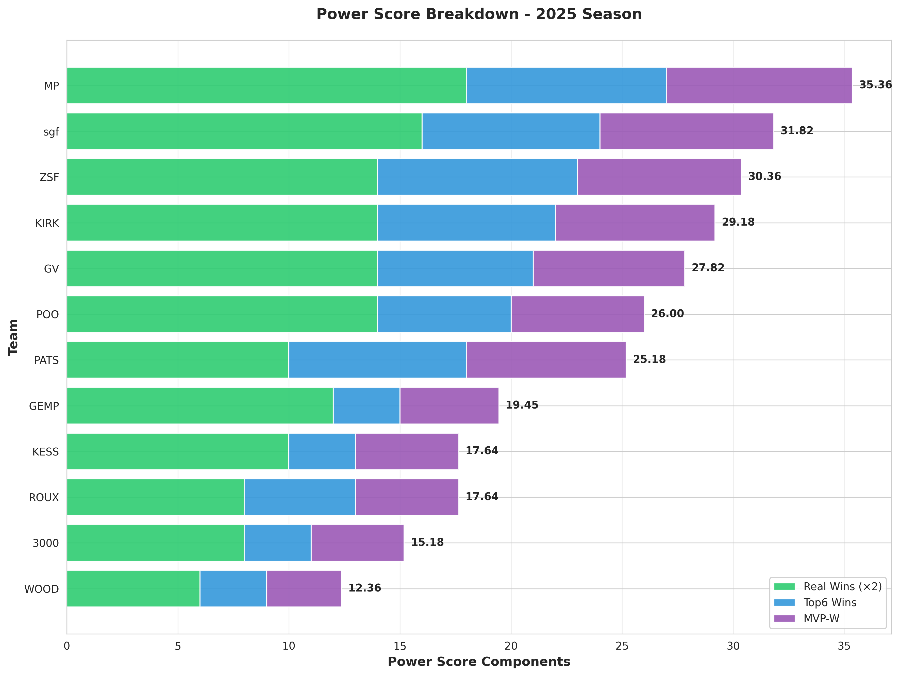

## Power Score Evolution Over Time

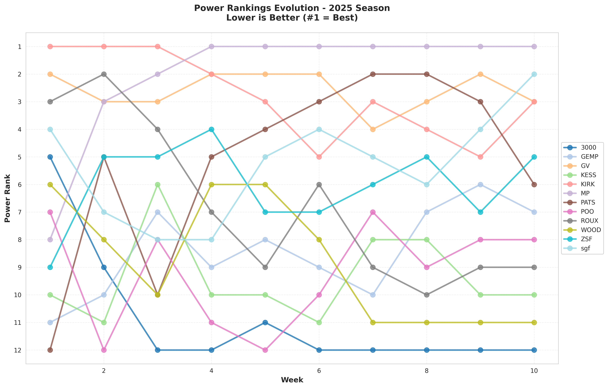

---

## Monte Carlo Simulation Methodology

### How We Predict the Future

Our playoff predictions use a **hybrid Monte Carlo simulation** that blends two data sources:

1. **OPTIMIZED Projections** (60% weight) - ESPN's projections **corrected** for BYE weeks and injuries, with intelligent bench substitutions applied. This is NOT raw ESPN data - we fix their broken methodology first (see the ESPN critique above).

2. **Historical Performance** (40% weight) - Each team's season-long PPG (points per game) and scoring variance, capturing their established scoring patterns.

### The Optimization Process

Before running any simulations, we transform ESPN's garbage projections into something useful:

```
Step 1: ESPN Raw         = Sum of all starter projections (BROKEN - includes BYE players)
Step 2: Corrected Base   = ESPN Raw - unavailable points (BYE/Injured = 0)
Step 3: OPTIMIZED        = Corrected Base + best bench replacements
```

The **OPTIMIZED** projection is what enters our Monte Carlo simulation - not ESPN's inflated nonsense.

### The Blending Formula

For each simulated game:
```
Expected Score = (0.6 × OPTIMIZED Projection) + (0.4 × Historical PPG)
Simulated Score = Random draw from Normal(Expected Score, Adjusted Variance)
```

### Roster Health Adjustment

Teams with injured players have **increased scoring variance** in the simulation. This reflects the uncertainty when backup players replace starters:
- Healthy roster (100%) → Standard variance
- Injured starters → Variance increased by up to 50%

### What We Track

For each of the 10,000 simulations, we record:
1. **Final Win Total** - How many wins each team ends with
2. **Final Points For** - Total season points (the tiebreaker for playoff seeding)
3. **Final Standing** - Where each team finishes in the standings

### League Prize Structure ($3,000 Pool)

This league means business. Here's how the $250 buy-in breaks down:

| Prize | Amount | Criteria |
|-------|--------|----------|
| **Weekly High Score** | $20 × 15 weeks = **$300** | Top scorer each week through Week 15 |
| **Playoff Pool** | $3,000 - $300 = **$2,700** | Split among top 3 playoff finishers |
| **Playoff 1st Place** | 55% of $2,700 = **$1,485** | Win the championship tournament |
| **Playoff 2nd Place** | 30% of $2,700 = **$810** | Lose in the finals |
| **Playoff 3rd Place** | 15% of $2,700 = **$405** | Win the consolation bracket |
| **Points-For Champion** | **50% of Total FAAB Spent** | Highest regular season Points For |

The Points-For prize is unique: whoever scores the most total points during the regular season wins **half of all FAAB spent** by managers. Every dollar spent on waivers contributes $0.50 to this prize pool. Even if you miss the playoffs, outscore everyone else and you walk away with cash.

### Why Points For Matters

Points For serves two purposes:
1. **Tiebreaker for playoff seeding** - Two teams with identical records? The one with more total points gets the higher seed.
2. **Cash prize** - Highest Points For at season's end wins the FAAB pool. Our simulation tracks Point-For leader probability for each team.

### What "#1 Seed %" Means

The **#1 Seed %** column shows your probability of finishing as the **regular season champion** - the top seed heading into playoffs. This is based on finishing with the best record (and Points For as tiebreaker). This is NOT the probability of winning the playoff tournament.

### Assumptions & Limitations

- **QUESTIONABLE players are assumed to play** - Historical data shows 80%+ of Questionable players suit up on game day. We treat them as healthy to avoid overly pessimistic projections.
- **FLEX position accepts RB, WR, or TE** - When optimizing lineups, the top projected RB, WR, or TE from the bench can fill the Flex slot.
- Our OPTIMIZED projections fix ESPN's BYE/injury issues, but still depend on ESPN's underlying player projections
- Past scoring patterns may not continue (trades, injuries, bye weeks)
- Each game is simulated independently (no momentum modeling)
- We use Points For as the tiebreaker (matching your league settings)
- All matchup tables and commentary use OPTIMIZED data, not raw ESPN projections

---

## Monte Carlo Projection Summary

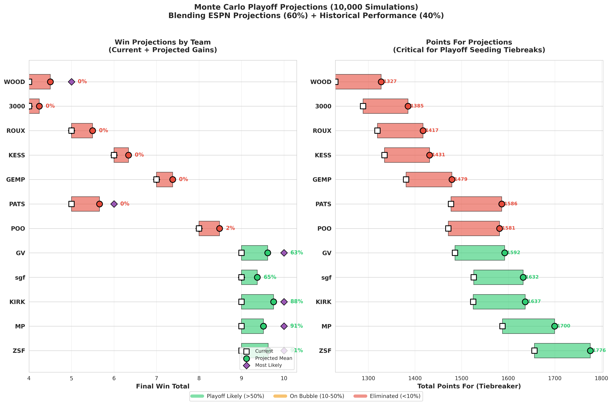

*Left: Win projections showing current wins plus expected gains. Right: Points For projections, critical for tiebreaker scenarios.*

---

## Playoff Predictions

Based on 10,000 Monte Carlo simulations blending ESPN projections with historical data.

| Team | Record | Playoff % | Most Likely Wins | Projected PF | Proj. Standing | #1 Seed % | PF Leader % |
|------|--------|-----------|------------------|--------------|----------------|----------------|-------------|
| ZSF | 9-5 | 90.7% | 10 | 1776 | #2.1 | 61.7% | 96.3% |
| MP | 9-5 | 91.0% | 10 | 1700 | #2.7 | 19.6% | 3.7% |
| KIRK | 9-5 | 87.3% | 10 | 1637 | #2.9 | 6.6% | 0.0% |
| sgf | 9-5 | 64.6% | 9 | 1633 | #3.5 | 11.9% | 0.0% |
| GV | 9-5 | 63.9% | 10 | 1593 | #4.0 | 0.2% | 0.0% |
| POO | 8-6 | 2.5% | 8 | 1582 | #5.8 | 0.0% | 0.0% |
| GEMP | 7-7 | 0.0% | 7 | 1479 | #7.0 | 0.0% | 0.0% |
| PATS | 5-9 | 0.0% | 6 | 1587 | #8.5 | 0.0% | 0.0% |
| KESS | 6-8 | 0.0% | 6 | 1431 | #8.8 | 0.0% | 0.0% |
| ROUX | 5-9 | 0.0% | 5 | 1417 | #9.7 | 0.0% | 0.0% |
| 3000 | 4-10 | 0.0% | 4 | 1385 | #11.4 | 0.0% | 0.0% |
| WOOD | 4-10 | 0.0% | 5 | 1328 | #11.6 | 0.0% | 0.0% |


> **Why Playoff % and Projected Standing Sometimes Conflict**
> 
> These two metrics measure different things and can appear contradictory:
> - **Playoff %** = How often does this team finish in the top 4 across all simulations?
> - **Projected Standing** = What's their *average* finishing position across all simulations?
> 
> A team can have a *lower* Playoff % but *better* Projected Standing if they have high-variance outcomes. For example, Team A might make playoffs 70% of the time but usually as the #4 seed (avg standing ~#4.5). Team B might make playoffs only 65% of the time, but when they do, they're often #1 or #2 (avg standing ~#3.0). Team B's better average standing reflects their upside, even though they miss playoffs more often.
> 
> **The tiebreaker (Points For) also matters.** Two teams with identical records get separated by total points. A team with high scoring variance might occasionally miss playoffs on tiebreakers (lowering Playoff %) but also occasionally win the #1 seed (improving avg standing).
> 
> *Bottom line: Playoff % tells you "will they make it?" while Projected Standing tells you "how good are they overall?"*

### Playoff Picture Analysis

**Locked In:** ZSF, MP - ESPN projections and historical data both agree: these teams are playoff-bound.

**Looking Good:** GV, sgf, KIRK - Strong position but not mathematically safe. The simulation likes their chances.

**Long Shots:** GEMP, POO, KESS, WOOD, ROUX, 3000, PATS - The simulations found very few paths to the playoffs. Time to play spoiler.

### Tiebreaker Watch: Points For Leaders

Since Points For is the tiebreaker, here's who's positioned best if records end up tied:

| Rank | Team | Current PF | Projected Final PF | Expected Addition |
|------|------|------------|-------------------|-------------------|
| 1 | ZSF | 1656 | 1776 | +119 |
| 2 | MP | 1588 | 1700 | +112 |
| 3 | KIRK | 1525 | 1637 | +112 |
| 4 | sgf | 1526 | 1633 | +107 |
| 5 | GV | 1486 | 1593 | +107 |
| 6 | PATS | 1477 | 1587 | +109 |


---

## Expected Monetary Payouts

Based on our Monte Carlo simulations, here's what each team can expect to earn. This factors in playoff probability, Points-For leader chances, and weekly high-score potential.

### Prize Pool Breakdown ($3,000 Total)

| Source | Amount | Details |
|--------|--------|---------|
| **Buy-In** | $250 × 12 teams | = **$3,000** total pool |
| **Weekly High Score** | $20 × 15 weeks | = **$300** allocated |
| **Playoff Pool** | $3,000 - $300 | = **$2,700** remaining |
| **1st Place** | 55% of $2,700 | = **$1,485** |
| **2nd Place** | 30% of $2,700 | = **$810** |
| **3rd Place** | 15% of $2,700 | = **$405** |
| **Points-For Champion** | 50% of Total FAAB | = **$240** (current) |

### FAAB Spending by Team (Incremental Cost)

FAAB spending is **additional cost beyond the $250 buy-in**. The Points-For winner takes home **half of all FAAB spent** across the league. Here's each manager's incremental investment:

| Team | FAAB Spent | Contribution to PF Prize |
|------|------------|-------------------------|
| PATS | $92 | $46 |
| ZSF | $88 | $44 |
| GV | $60 | $30 |
| KESS | $57 | $28 |
| POO | $52 | $26 |
| ROUX | $41 | $20 |
| KIRK | $30 | $15 |
| sgf | $24 | $12 |
| MP | $16 | $8 |
| GEMP | $12 | $6 |
| WOOD | $8 | $4 |
| 3000 | $0 | $0 |

| **TOTAL** | **$480** | **$240** (prize pool) |

### Expected Payouts Summary

Each manager's **total investment** = $250 buy-in + (FAAB Spent ÷ 2). Net Expected shows expected profit/loss after accounting for all costs.

| Team | Playoff % | PF Leader % | Total Cost | E[Playoff] | E[PF Prize] | E[Weekly] | E[Return] | **Net Expected** |
|------|-----------|-------------|------------|------------|-------------|-----------|-----------|------------------|
| ZSF | 90.7% | 96.3% | $294 | $972 | $231 | $29 | $1232 | **$938** |
| MP | 91.0% | 3.7% | $258 | $629 | $9 | $28 | $665 | **$407** |
| KIRK | 87.3% | 0.0% | $265 | $529 | $0 | $26 | $556 | **$291** |
| sgf | 64.6% | 0.0% | $262 | $371 | $0 | $26 | $397 | **$135** |
| GV | 63.9% | 0.0% | $280 | $198 | $0 | $26 | $224 | **$-56** |
| 3000 | 0.0% | 0.0% | $250 | $0 | $0 | $22 | $22 | **$-228** |
| GEMP | 0.0% | 0.0% | $256 | $0 | $0 | $24 | $24 | **$-232** |
| WOOD | 0.0% | 0.0% | $254 | $0 | $0 | $21 | $21 | **$-233** |
| ROUX | 0.0% | 0.0% | $270 | $0 | $0 | $23 | $23 | **$-248** |
| POO | 2.5% | 0.0% | $276 | $1 | $0 | $26 | $26 | **$-250** |
| KESS | 0.0% | 0.0% | $278 | $0 | $0 | $23 | $23 | **$-255** |
| PATS | 0.0% | 0.0% | $296 | $0 | $0 | $26 | $26 | **$-270** |


### How Expected Payouts Are Calculated

1. **E[Playoff]** = P(1st) × $1,485 + P(2nd) × $810 + P(3rd) × $405
   - Uses actual placement probabilities from Monte Carlo simulations
   - **Sum of all teams' E[Playoff] = $2,700 exactly** (the full playoff pool)
   
2. **E[PF Prize]** = PF Leader % × $240 (current FAAB pool ÷ 2)
   - Your probability of finishing with the most Points For × the prize
   
3. **E[Weekly]** = Probability × $300 (total weekly pool)
   - Each team's probability = their PPG ÷ total league PPG
   - **Sum of all teams' E[Weekly] = $300 exactly**

4. **Total Cost** = $250 buy-in + (FAAB Spent ÷ 2)
   - Every manager pays $250 to enter
   - FAAB spending is **incremental cost beyond the buy-in**
   - Half of your FAAB goes to the Points-For prize pool

5. **E[Return]** = E[Playoff] + E[PF Prize] + E[Weekly]
   - Your total expected winnings before costs

**Net Expected = E[Return] - Total Cost**
   - Positive = expected profit
   - Negative = expected loss

*Note: E[Playoff] uses position-specific probabilities (1st/2nd/3rd) from Monte Carlo simulations, ensuring all expected payouts sum to exactly the prize pool.*

---

## The Lineup Optimizer: Your Secret Weapon

**This is where our analysis truly shines.** While ESPN happily includes BYE-week players in their projections (as if by magic they'll still score points from their couches), our **Lineup Optimizer** does what any competent fantasy manager should do: it identifies unavailable starters and finds the best possible bench replacements.

The Optimizer is nothing short of **revolutionary**. It scans every roster, detects BYE weeks using the official 2025 NFL schedule, identifies injured starters, and automatically calculates the optimal substitution from your bench. The result? **Projections that reflect reality, not ESPN's fantasy land.**

### How the Optimizer Works

1. **BYE Week Detection** - Cross-references every player's NFL team against the 2025 bye schedule
2. **Injury Scanning** - Identifies starters with OUT, IR, DOUBTFUL, or SUSPENSION status (QUESTIONABLE players are assumed to play)
3. **Position Matching** - Finds bench players eligible for each vacant starter slot (FLEX accepts RB, WR, or TE)
4. **Gain Calculation** - Computes the projected point improvement from each substitution
5. **Confidence Scoring** - Rates each move based on player projections and matchup strength

### Key Modeling Assumptions

- **QUESTIONABLE = Will Play** - Historical NFL data shows 80%+ of Questionable players suit up. We don't penalize these players.
- **FLEX Flexibility** - When filling the Flex slot, we consider the top projected RB, WR, or TE from your bench - whichever scores highest.

### Key Lineup Moves This Week

*All teams have optimal lineups set for the remaining weeks - no BYE or injury substitutions needed. The Optimizer found no improvements to suggest, which means every manager has already made the right calls. Well done, league!*

---

## Remaining Schedule (Weeks 15-15)

*Win probabilities based on blended OPTIMIZED projections (60%) and historical data (40%). ESPN's broken projections have been corrected for BYE weeks and injuries before blending.*

### Week 15

*Using OPTIMIZED projections (BYE/injured players zeroed, bench substitutions applied)*

| Matchup | Optimized Proj | Historical PPG | MC Blended | Favorite | Win Prob |
|---------|----------------|----------------|------------|----------|----------|
| WOOD vs ROUX | 105.3 vs 100.5 | 87.8 vs 94.2 | 98.3 vs 98.0 | WOOD | 51% |
| GEMP vs GV | 97.9 vs 107.5 | 98.6 vs 106.1 | 98.2 vs 107.0 | GV | 63% |
| KESS vs PATS | 97.0 vs 111.1 | 95.3 vs 105.5 | 96.3 vs 108.9 | PATS | 67% |
| MP vs POO | 110.7 vs 113.5 | 113.4 vs 105.1 | 111.8 vs 110.1 | MP | 52% |
| KIRK vs 3000 | 113.6 vs 99.9 | 108.9 vs 92.0 | 111.7 vs 96.8 | KIRK | 77% |
| sgf vs ZSF | 104.7 vs 119.6 | 109.0 vs 118.3 | 106.4 vs 119.1 | ZSF | 63% |

---

## Roster Health Report

*Comprehensive injury status for all rostered players. Severity reflects likelihood of missing games and roster impact.*

### Severity Guide

| Status | Severity | Meaning |
|--------|----------|---------|
| **Q** (Questionable) | Minor Concern | Likely to play (80%+ historical play rate) |
| **D** (Doubtful) | Moderate Concern | Unlikely to play, but still possible |
| **O** (Out) | Major Concern | Confirmed out this week - find a replacement |
| **IR** | Why is he even on your roster?! | Long-term injury, taking up a roster spot |

### Team-by-Team Injury Report

**WOOD** (Health: 67%)

| Player | Position | Status | Severity | Role |
|--------|----------|--------|----------|------|
| Tucker Kraft | WR | IR | Why is he even on your roster?! | IR Slot |
| Josh Jacobs | RB | Q | Minor Concern | Starter |
| Aaron Jones Sr. | RB | Q | Minor Concern | Starter |
| Nick Chubb | RB | Q | Minor Concern | Bench |
| David Njoku | WR | Q | Minor Concern | Bench |
| Theo Johnson | WR | Q | Minor Concern | Starter |

**POO** (Health: 78%)

| Player | Position | Status | Severity | Role |
|--------|----------|--------|----------|------|
| CeeDee Lamb | RB | Q | Minor Concern | Starter |
| Devin Neal | RB | Q | Minor Concern | Bench |
| Ladd McConkey | RB | Q | Minor Concern | Starter |

**3000** (Health: 89%)

| Player | Position | Status | Severity | Role |
|--------|----------|--------|----------|------|
| Cade Otton | WR | O | Major Concern | Bench (O) |
| Woody Marks | RB | Q | Minor Concern | Starter |
| Jayden Reed | RB | Q | Minor Concern | IR Slot |

**sgf** (Health: 89%)

| Player | Position | Status | Severity | Role |
|--------|----------|--------|----------|------|
| Sam LaPorta | WR | IR | Why is he even on your roster?! | IR Slot |
| Christian McCaffrey | RB | Q | Minor Concern | Starter |
| Marvin Harrison Jr. | RB | Q | Minor Concern | Bench |

**ROUX** (Health: 89%)

| Player | Position | Status | Severity | Role |
|--------|----------|--------|----------|------|
| Chris Rodriguez Jr. | RB | Q | Minor Concern | Starter |

**MP** (Health: 89%)

| Player | Position | Status | Severity | Role |
|--------|----------|--------|----------|------|
| Cam Skattebo | RB | IR | Why is he even on your roster?! | IR Slot |
| Justin Herbert | QB | Q | Minor Concern | Bench |
| Breece Hall | RB | Q | Minor Concern | Starter |

**KESS** (Health: 89%)

| Player | Position | Status | Severity | Role |
|--------|----------|--------|----------|------|
| Zach Ertz | WR | IR | Why is he even on your roster?! | Bench (IR) |
| Joe Mixon | RB | O | Major Concern | IR Slot |
| Jordan Addison | RB | Q | Minor Concern | Bench |
| Mark Andrews | WR | Q | Minor Concern | Starter |
| Alvin Kamara | RB | Q | Minor Concern | Bench |

**ZSF** (Health: 89%)

| Player | Position | Status | Severity | Role |
|--------|----------|--------|----------|------|
| Drake London | RB | O | Major Concern | IR Slot |
| De'Von Achane | RB | Q | Minor Concern | Starter |
| Rome Odunze | RB | Q | Minor Concern | Bench |

**KIRK** (Health: 89%)

| Player | Position | Status | Severity | Role |
|--------|----------|--------|----------|------|
| Davante Adams | RB | Q | Minor Concern | Starter |

**PATS** (Health: 100%)

| Player | Position | Status | Severity | Role |
|--------|----------|--------|----------|------|
| Trey Benson | RB | IR | Why is he even on your roster?! | IR Slot |
| Jayden Daniels | QB | O | Major Concern | Bench (O) |

**GV** (Health: 100%)

| Player | Position | Status | Severity | Role |
|--------|----------|--------|----------|------|
| Jake Ferguson | WR | Q | Minor Concern | Bench |

**GEMP** (Health: 100%)

| Player | Position | Status | Severity | Role |
|--------|----------|--------|----------|------|
| Daniel Jones | QB | IR | Why is he even on your roster?! | Bench (IR) |
| Tyler Bass | WR | IR | Why is he even on your roster?! | IR Slot |
| Garrett Wilson | RB | IR | Why is he even on your roster?! | Bench (IR) |
| Tee Higgins | RB | Q | Minor Concern | Bench |

---

## Team-by-Team Analysis

*Each team's analysis includes win/points projections, roster health status, and playoff outlook.*

### #1 ZSF - Power Score: 38.27

**Record:** 9-5 | **PPG:** 118.31 | **Total PF:** 1656 | **Top6:** 11 | **MVP-W:** 9.27 | **WAX:** -0.27

Sitting atop the standings with a commanding 9-5 record, this team has earned the top spot through dominant performance. Their 118.31 PPG leads the league, which translates to an impressive 9.27 MVP-W and 11 top-6 weekly finishes. Their -0.27 WAX shows they're earning their wins fair and square - no luck needed. 

**Projection Summary:** Most likely finish: **10 wins** | Projected PF: **1776** | Playoff: **90.7%** | #1 Seed: **61.7%** 

**Projection Breakdown (Avg Per Game, Weeks 13-15):** 
| Source | Projection | Notes | 
|--------|------------|-------| 
| ESPN Raw | 119.6 pts | ESPN projection (includes BYE/injured starters) | 
| **Optimized** | **119.6 pts** | ESPN Raw - unavailable + bench subs | 
| Historical PPG | 118.3 pts | Season average through week 12 | 
| Monte Carlo Input | 119.1 pts | 60% Optimized + 40% Historical | 

*Strong odds at 91%, but fantasy football loves chaos. One bad week and this could get interesting. Key injuries to De'Von Achane (QUESTIONABLE) are devastating - the variance multiplier of 1.15x reflects massive uncertainty. Watch for potential boost if Drake London return(s) - could shift the distribution upward.* 

**Roster Health & Availability Report:** 
Key injuries: De'Von Achane (RB, QUESTIONABLE). Bench depth: James Cook III (RB) available. Watch for return: Drake London. 

*Injured Starters (1):* 
- **De'Von Achane** (RB, QUESTIONABLE) ⭐: 21.3 pts proj, Questionable - assumed to play (historical: 80%+ play rate) 

*Potential Returns:* 
- **Drake London** (RB): OUT - may return soon 

*Monte Carlo Variance Impact:* Roster uncertainty increased simulation variance by **15%**, widening outcome distributions. This means higher upside but also higher downside risk. 

**Lineup Status:** Optimally set - no BYE week or injury substitutions needed.


**Upcoming Matchups & Roster Decisions:**
 
**Week 15 vs sgf:**
 | Projection Type | ZSF | sgf | 
|-----------------|--------|----------| 
| ESPN Raw | 119.6 | 104.7 | 
| Corrected (BYE/Inj=0) | 119.6 | 104.7 | 
| **Optimized (+Bench)** | **119.6** | **104.7** | 
| Historical PPG | 118.3 | 109.0 | 
| **MC Blended** | **119.1** | **106.4** | 

*Expected Outcome:* **Favored** (75% win probability) | Spread: +12.6 

*Roster Decisions:* None needed - lineup is optimally set. 

**Projected Season Totals (Optimized):** 
- Current PF: 1656 
- Expected Additional PF: +119 
- **Projected Final PF: 1775**

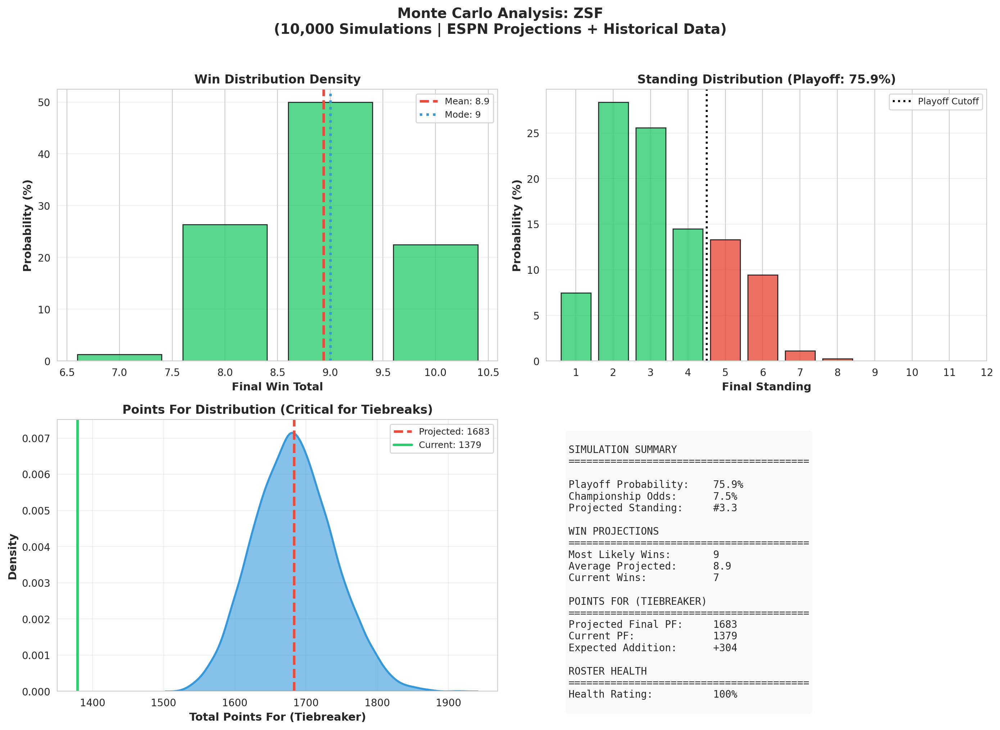

---

### #2 MP - Power Score: 37.36

**Record:** 9-5 | **PPG:** 113.42 | **Total PF:** 1588 | **Top6:** 10 | **MVP-W:** 9.36 | **WAX:** -0.36

Second place with 9-5, trailing the leader by 0.91 power points. Scoring 113.42 PPG with 10 top-6 finishes shows genuine quality. That -0.36 WAX is frustrating - a bit more luck and they'd be in first. 

**Projection Summary:** Most likely finish: **10 wins** | Projected PF: **1700** | Playoff: **91.0%** | #1 Seed: **19.6%** 

**Projection Breakdown (Avg Per Game, Weeks 13-15):** 
| Source | Projection | Notes | 
|--------|------------|-------| 
| ESPN Raw | 110.7 pts | ESPN projection (includes BYE/injured starters) | 
| **Optimized** | **110.7 pts** | ESPN Raw - unavailable + bench subs | 
| Historical PPG | 113.4 pts | Season average through week 12 | 
| Monte Carlo Input | 111.8 pts | 60% Optimized + 40% Historical | 

*Strong odds at 91%, but fantasy football loves chaos. One bad week and this could get interesting. Key injuries to Breece Hall (QUESTIONABLE) are devastating - the variance multiplier of 1.08x reflects massive uncertainty.* 

**Roster Health & Availability Report:** 
Key injuries: Breece Hall (RB, QUESTIONABLE). 

*Injured Starters (1):* 
- **Breece Hall** (RB, QUESTIONABLE) ⭐: 15.2 pts proj, Questionable - assumed to play (historical: 80%+ play rate) 

*Monte Carlo Variance Impact:* Roster uncertainty increased simulation variance by **8%**, widening outcome distributions. This means higher upside but also higher downside risk. 

**Lineup Status:** Optimally set - no BYE week or injury substitutions needed.


**Upcoming Matchups & Roster Decisions:**
 
**Week 15 vs POO:**
 | Projection Type | MP | POO | 
|-----------------|--------|----------| 
| ESPN Raw | 110.7 | 113.5 | 
| Corrected (BYE/Inj=0) | 110.7 | 113.5 | 
| **Optimized (+Bench)** | **110.7** | **113.5** | 
| Historical PPG | 113.4 | 105.1 | 
| **MC Blended** | **111.8** | **110.1** | 

*Expected Outcome:* Toss-up (55% win probability) | Spread: +1.7 

*Roster Decisions:* None needed - lineup is optimally set. 

**Projected Season Totals (Optimized):** 
- Current PF: 1588 
- Expected Additional PF: +112 
- **Projected Final PF: 1700**

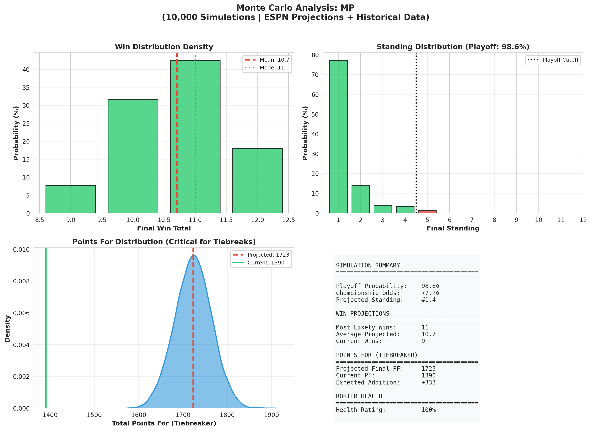

---

### #3 KIRK - Power Score: 36.55

**Record:** 9-5 | **PPG:** 108.92 | **Total PF:** 1525 | **Top6:** 10 | **MVP-W:** 8.55 | **WAX:** +0.45

Currently in the playoff picture at #3 with a 9-5 record. Their 108.92 PPG and 8.55 MVP-W put them in solid position. 10 top-6 finishes in 14 weeks shows they can compete with anyone. 

**Projection Summary:** Most likely finish: **10 wins** | Projected PF: **1637** | Playoff: **87.3%** | #1 Seed: **6.6%** 

**Projection Breakdown (Avg Per Game, Weeks 13-15):** 
| Source | Projection | Notes | 
|--------|------------|-------| 
| ESPN Raw | 113.6 pts | ESPN projection (includes BYE/injured starters) | 
| **Optimized** | **113.6 pts** | ESPN Raw - unavailable + bench subs | 
| Historical PPG | 108.9 pts | Season average through week 12 | 
| Monte Carlo Input | 111.7 pts | 60% Optimized + 40% Historical | 

*Strong odds at 87%, but fantasy football loves chaos. One bad week and this could get interesting. Injuries to Davante Adams (QUESTIONABLE) add unpredictability to the projections.* 

**Roster Health & Availability Report:** 
Key injuries: Davante Adams (RB, QUESTIONABLE). 

*Injured Starters (1):* 
- **Davante Adams** (RB, QUESTIONABLE) ⭐: 14.2 pts proj, Questionable - assumed to play (historical: 80%+ play rate) 

*Monte Carlo Variance Impact:* Roster uncertainty increased simulation variance by **6%**, widening outcome distributions. This means higher upside but also higher downside risk. 

**Lineup Status:** Optimally set - no BYE week or injury substitutions needed.


**Upcoming Matchups & Roster Decisions:**
 
**Week 15 vs 3000:**
 | Projection Type | KIRK | 3000 | 
|-----------------|--------|----------| 
| ESPN Raw | 113.6 | 99.9 | 
| Corrected (BYE/Inj=0) | 113.6 | 99.9 | 
| **Optimized (+Bench)** | **113.6** | **99.9** | 
| Historical PPG | 108.9 | 92.0 | 
| **MC Blended** | **111.7** | **96.7** | 

*Expected Outcome:* **Favored** (80% win probability) | Spread: +15.0 

*Roster Decisions:* None needed - lineup is optimally set. 

**Projected Season Totals (Optimized):** 
- Current PF: 1525 
- Expected Additional PF: +112 
- **Projected Final PF: 1637**

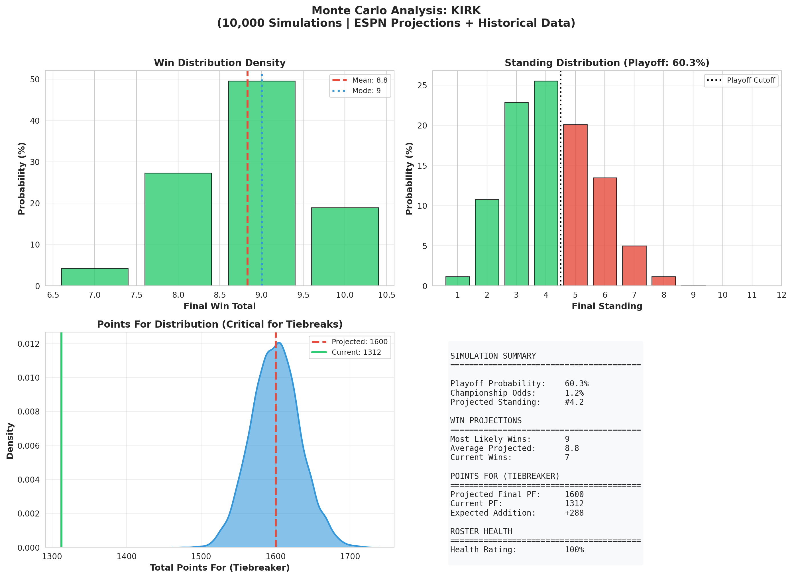

---

### #4 sgf - Power Score: 34.36

**Record:** 9-5 | **PPG:** 109.01 | **Total PF:** 1526 | **Top6:** 8 | **MVP-W:** 8.36 | **WAX:** +0.64

Currently in the playoff picture at #4 with a 9-5 record. Their 109.01 PPG and 8.36 MVP-W put them in solid position. 8 top-6 finishes in 14 weeks shows they can compete with anyone. 

**Projection Summary:** Most likely finish: **9 wins** | Projected PF: **1633** | Playoff: **64.6%** | #1 Seed: **11.9%** 

**Projection Breakdown (Avg Per Game, Weeks 13-15):** 
| Source | Projection | Notes | 
|--------|------------|-------| 
| ESPN Raw | 104.7 pts | ESPN projection (includes BYE/injured starters) | 
| **Optimized** | **104.7 pts** | ESPN Raw - unavailable + bench subs | 
| Historical PPG | 109.0 pts | Season average through week 12 | 
| Monte Carlo Input | 106.4 pts | 60% Optimized + 40% Historical | 

*Right on the knife's edge at 65%. ESPN projects enough points to stay competitive, but so does everyone else. 1 starter(s) dealing with injuries adds some variance (1.05x) to these projections. Only 0.4 more projected wins suggests a rough finish ahead.* 

**Roster Health & Availability Report:** 
1 minor injury(s) in lineup. Bench depth: Jared Goff (QB) available. 

*Injured Starters (1):* 
- **Christian McCaffrey** (RB, QUESTIONABLE): 0.0 pts proj, Questionable - assumed to play (historical: 80%+ play rate) 

**Lineup Status:** Optimally set - no BYE week or injury substitutions needed.


**Upcoming Matchups & Roster Decisions:**
 
**Week 15 vs ZSF:**
 | Projection Type | sgf | ZSF | 
|-----------------|--------|----------| 
| ESPN Raw | 104.7 | 119.6 | 
| Corrected (BYE/Inj=0) | 104.7 | 119.6 | 
| **Optimized (+Bench)** | **104.7** | **119.6** | 
| Historical PPG | 109.0 | 118.3 | 
| **MC Blended** | **106.4** | **119.1** | 

*Expected Outcome:* Underdog (25% win probability) | Spread: -12.6 

*Roster Decisions:* None needed - lineup is optimally set. 

**Projected Season Totals (Optimized):** 
- Current PF: 1526 
- Expected Additional PF: +106 
- **Projected Final PF: 1632**

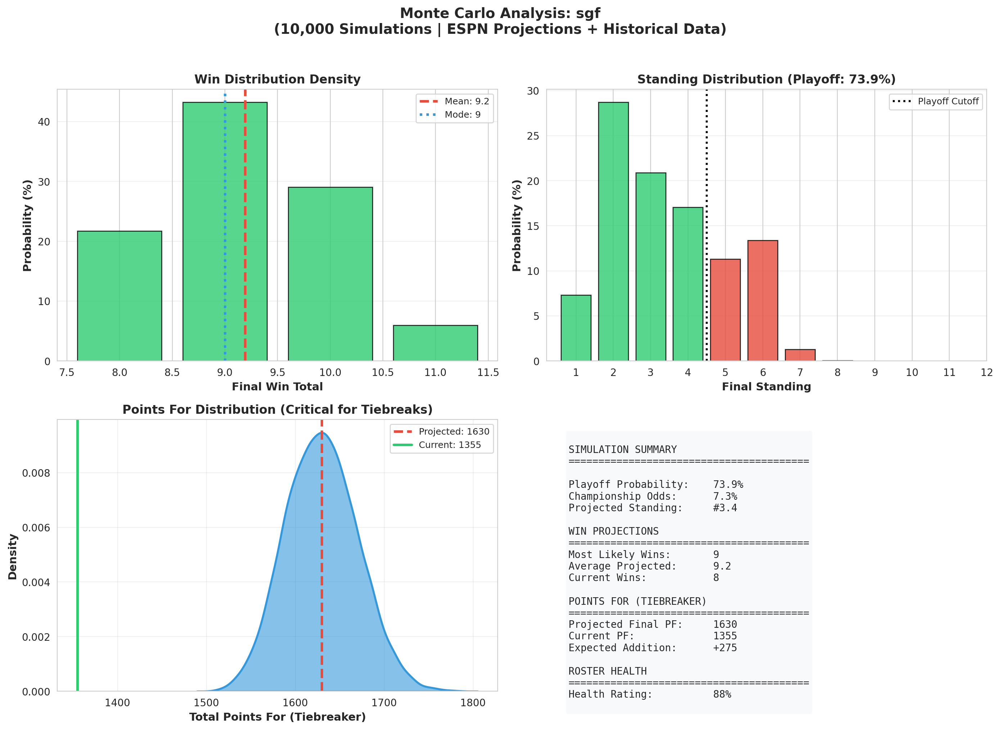

---

### #5 GV - Power Score: 34.18

**Record:** 9-5 | **PPG:** 106.14 | **Total PF:** 1486 | **Top6:** 8 | **MVP-W:** 8.18 | **WAX:** +0.82

On the playoff bubble at #5 with 9-5. Still in decent shape with 63.9% playoff odds. Their 106.14 PPG and 8 top-6 finishes show potential. They've benefited from +0.82 WAX - riding some good matchups. 

**Projection Summary:** Most likely finish: **10 wins** | Projected PF: **1593** | Playoff: **63.9%** | #1 Seed: **0.2%** 

**Projection Breakdown (Avg Per Game, Weeks 13-15):** 
| Source | Projection | Notes | 
|--------|------------|-------| 
| ESPN Raw | 107.5 pts | ESPN projection (includes BYE/injured starters) | 
| **Optimized** | **107.5 pts** | ESPN Raw - unavailable + bench subs | 
| Historical PPG | 106.1 pts | Season average through week 12 | 
| Monte Carlo Input | 107.0 pts | 60% Optimized + 40% Historical | 

*Right on the knife's edge at 64%. ESPN projects enough points to stay competitive, but so does everyone else.* 

**Lineup Status:** Optimally set - no BYE week or injury substitutions needed.


**Upcoming Matchups & Roster Decisions:**
 
**Week 15 vs GEMP:**
 | Projection Type | GV | GEMP | 
|-----------------|--------|----------| 
| ESPN Raw | 107.5 | 97.9 | 
| Corrected (BYE/Inj=0) | 107.5 | 97.9 | 
| **Optimized (+Bench)** | **107.5** | **97.9** | 
| Historical PPG | 106.1 | 98.6 | 
| **MC Blended** | **107.0** | **98.2** | 

*Expected Outcome:* **Favored** (72% win probability) | Spread: +8.8 

*Roster Decisions:* None needed - lineup is optimally set. 

**Projected Season Totals (Optimized):** 
- Current PF: 1486 
- Expected Additional PF: +107 
- **Projected Final PF: 1593**

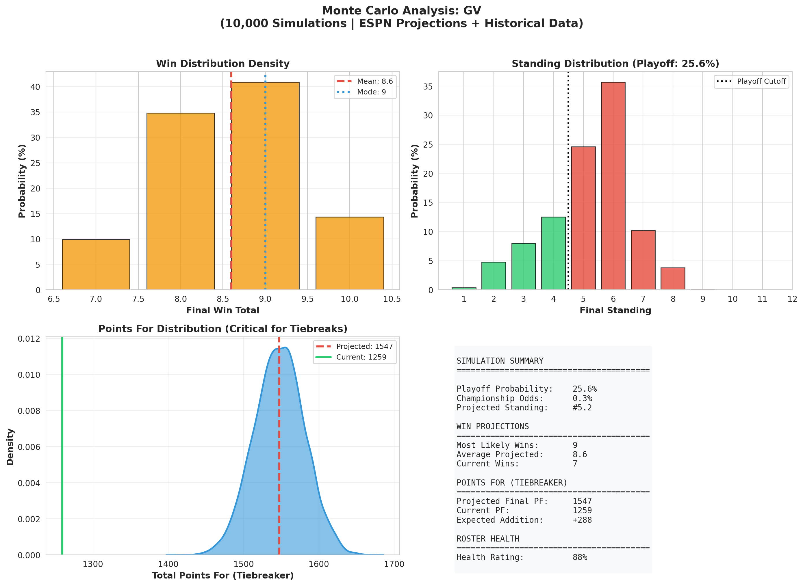

---

### #6 POO - Power Score: 30.09

**Record:** 8-6 | **PPG:** 105.10 | **Total PF:** 1471 | **Top6:** 7 | **MVP-W:** 7.09 | **WAX:** +0.91

On the playoff bubble at #6 with 8-6. Need to step it up - only 2.5% playoff odds right now. Their 105.10 PPG and 7 top-6 finishes show potential. They've benefited from +0.91 WAX - riding some good matchups. 

**Projection Summary:** Most likely finish: **8 wins** | Projected PF: **1582** | Playoff: **2.5%** | #1 Seed: **0.0%** 

**Projection Breakdown (Avg Per Game, Weeks 13-15):** 
| Source | Projection | Notes | 
|--------|------------|-------| 
| ESPN Raw | 113.5 pts | ESPN projection (includes BYE/injured starters) | 
| **Optimized** | **113.5 pts** | ESPN Raw - unavailable + bench subs | 
| Historical PPG | 105.1 pts | Season average through week 12 | 
| Monte Carlo Input | 110.1 pts | 60% Optimized + 40% Historical | 

*The computer ran 10,000 simulations and found essentially no path to the playoffs. Time to play spoiler. Key injuries to CeeDee Lamb (QUESTIONABLE) are devastating - the variance multiplier of 1.12x reflects massive uncertainty. Only 0.5 more projected wins suggests a rough finish ahead.* 

**Roster Health & Availability Report:** 
Key injuries: CeeDee Lamb (RB, QUESTIONABLE). 

*Injured Starters (2):* 
- **CeeDee Lamb** (RB, QUESTIONABLE) ⭐: 16.2 pts proj, Questionable - assumed to play (historical: 80%+ play rate) 
- **Ladd McConkey** (RB, QUESTIONABLE): 10.0 pts proj, Questionable - assumed to play (historical: 80%+ play rate) 

*Monte Carlo Variance Impact:* Roster uncertainty increased simulation variance by **12%**, widening outcome distributions. This means higher upside but also higher downside risk. 

**Lineup Status:** Optimally set - no BYE week or injury substitutions needed.


**Upcoming Matchups & Roster Decisions:**
 
**Week 15 vs MP:**
 | Projection Type | POO | MP | 
|-----------------|--------|----------| 
| ESPN Raw | 113.5 | 110.7 | 
| Corrected (BYE/Inj=0) | 113.5 | 110.7 | 
| **Optimized (+Bench)** | **113.5** | **110.7** | 
| Historical PPG | 105.1 | 113.4 | 
| **MC Blended** | **110.1** | **111.8** | 

*Expected Outcome:* Underdog (45% win probability) | Spread: -1.7 

*Roster Decisions:* None needed - lineup is optimally set. 

**Projected Season Totals (Optimized):** 
- Current PF: 1471 
- Expected Additional PF: +110 
- **Projected Final PF: 1582**

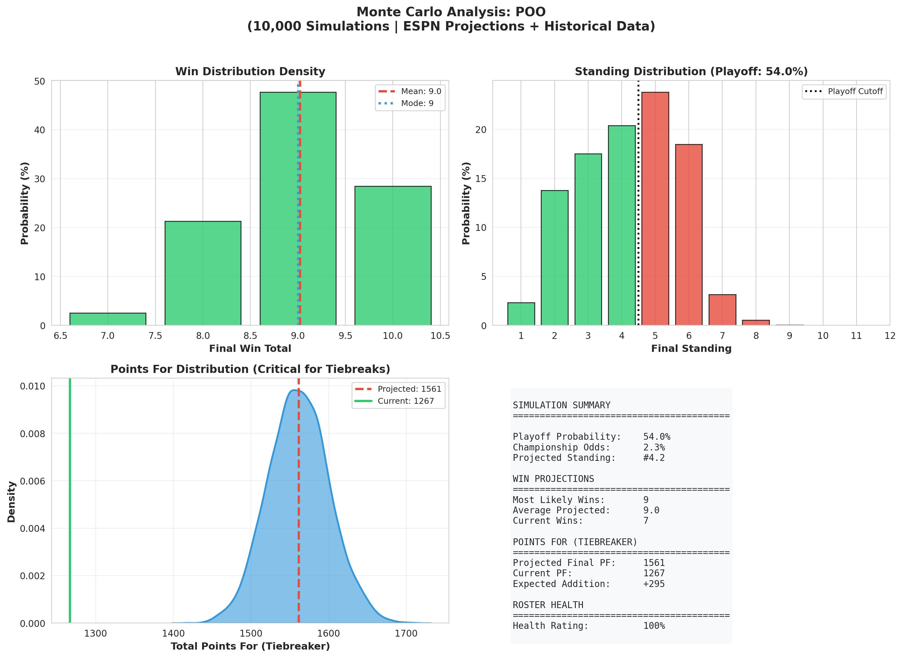

---

### #7 PATS - Power Score: 26.82

**Record:** 5-9 | **PPG:** 105.53 | **Total PF:** 1477 | **Top6:** 9 | **MVP-W:** 7.82 | **WAX:** -2.82

Sitting at #7 with a 5-9 record - outside looking in. At just 0.0% playoff odds, it would take a miracle. Their 105.53 PPG suggests they have some scoring punch. The -2.82 WAX means they're better than their record - just unlucky. 

**Projection Summary:** Most likely finish: **6 wins** | Projected PF: **1587** | Playoff: **0.0%** | #1 Seed: **0.0%** 

**Projection Breakdown (Avg Per Game, Weeks 13-15):** 
| Source | Projection | Notes | 
|--------|------------|-------| 
| ESPN Raw | 111.1 pts | ESPN projection (includes BYE/injured starters) | 
| **Optimized** | **111.1 pts** | ESPN Raw - unavailable + bench subs | 
| Historical PPG | 105.5 pts | Season average through week 12 | 
| Monte Carlo Input | 108.9 pts | 60% Optimized + 40% Historical | 

*The computer ran 10,000 simulations and found essentially no path to the playoffs. Time to play spoiler. Watch for potential boost if Jayden Daniels return(s) - could shift the distribution upward. Injured bench talent (Jayden Daniels (QB)) waiting in the wings if healthy.* 

**Roster Health & Availability Report:** 
Fully healthy starting lineup. Watch for return: Jayden Daniels. 

*Potential Returns:* 
- **Jayden Daniels** (QB): OUT - may return soon 

*Injured Bench Players (High-Value):* 
- **Jayden Daniels** (QB, OUT): 18.4 pts proj when healthy 

**Lineup Status:** Optimally set - no BYE week or injury substitutions needed.


**Upcoming Matchups & Roster Decisions:**
 
**Week 15 vs KESS:**
 | Projection Type | PATS | KESS | 
|-----------------|--------|----------| 
| ESPN Raw | 111.1 | 97.0 | 
| Corrected (BYE/Inj=0) | 111.1 | 97.0 | 
| **Optimized (+Bench)** | **111.1** | **97.0** | 
| Historical PPG | 105.5 | 95.3 | 
| **MC Blended** | **108.9** | **96.3** | 

*Expected Outcome:* **Favored** (75% win probability) | Spread: +12.6 

*Roster Decisions:* None needed - lineup is optimally set. 

**Projected Season Totals (Optimized):** 
- Current PF: 1477 
- Expected Additional PF: +109 
- **Projected Final PF: 1586**

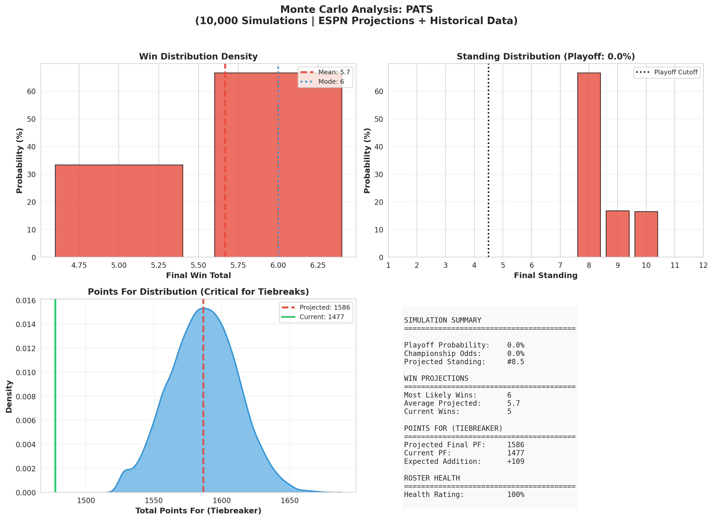

---

### #8 GEMP - Power Score: 23.55

**Record:** 7-7 | **PPG:** 98.63 | **Total PF:** 1381 | **Top6:** 4 | **MVP-W:** 5.55 | **WAX:** +1.45

Sitting at #8 with a 7-7 record - outside looking in. At just 0.0% playoff odds, it would take a miracle. Their 98.63 PPG suggests they have some scoring punch. That +1.45 WAX is actually concerning - they've been lucky and still can't crack the top 6. 

**Projection Summary:** Most likely finish: **7 wins** | Projected PF: **1479** | Playoff: **0.0%** | #1 Seed: **0.0%** 

**Projection Breakdown (Avg Per Game, Weeks 13-15):** 
| Source | Projection | Notes | 
|--------|------------|-------| 
| ESPN Raw | 97.9 pts | ESPN projection (includes BYE/injured starters) | 
| **Optimized** | **97.9 pts** | ESPN Raw - unavailable + bench subs | 
| Historical PPG | 98.6 pts | Season average through week 12 | 
| Monte Carlo Input | 98.2 pts | 60% Optimized + 40% Historical | 

*The computer ran 10,000 simulations and found essentially no path to the playoffs. Time to play spoiler. Only 0.4 more projected wins suggests a rough finish ahead.* 

**Lineup Status:** Optimally set - no BYE week or injury substitutions needed.


**Upcoming Matchups & Roster Decisions:**
 
**Week 15 vs GV:**
 | Projection Type | GEMP | GV | 
|-----------------|--------|----------| 
| ESPN Raw | 97.9 | 107.5 | 
| Corrected (BYE/Inj=0) | 97.9 | 107.5 | 
| **Optimized (+Bench)** | **97.9** | **107.5** | 
| Historical PPG | 98.6 | 106.1 | 
| **MC Blended** | **98.2** | **107.0** | 

*Expected Outcome:* Underdog (28% win probability) | Spread: -8.8 

*Roster Decisions:* None needed - lineup is optimally set. 

**Projected Season Totals (Optimized):** 
- Current PF: 1381 
- Expected Additional PF: +98 
- **Projected Final PF: 1479**

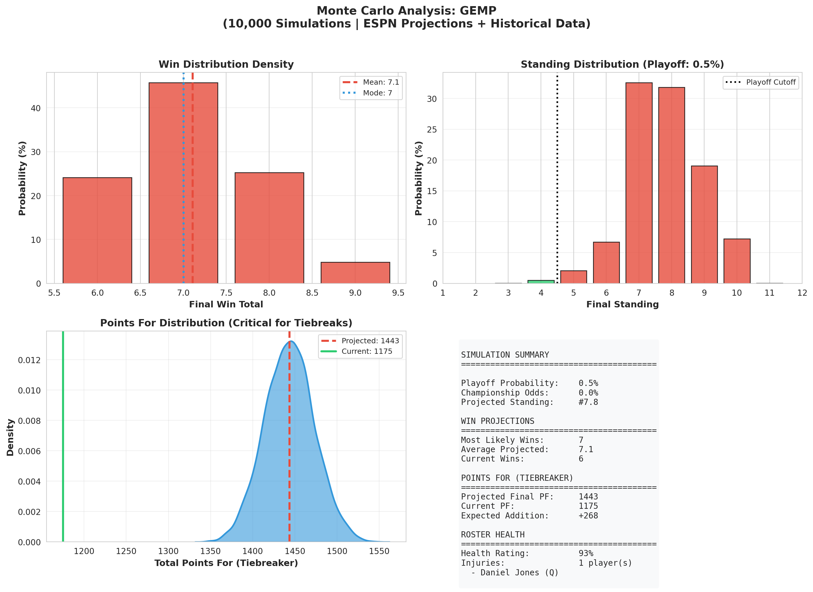

---

### #9 KESS - Power Score: 21.27

**Record:** 6-8 | **PPG:** 95.34 | **Total PF:** 1335 | **Top6:** 4 | **MVP-W:** 5.27 | **WAX:** +0.73

At #9 with 6-8, the season hasn't gone as planned. Averaging 95.34 PPG with only 4 top-6 finishes in 14 weeks. The +0.73 WAX is a red flag - even with good luck, they're struggling. 

**Projection Summary:** Most likely finish: **6 wins** | Projected PF: **1431** | Playoff: **0.0%** | #1 Seed: **0.0%** 

**Projection Breakdown (Avg Per Game, Weeks 13-15):** 
| Source | Projection | Notes | 
|--------|------------|-------| 
| ESPN Raw | 97.0 pts | ESPN projection (includes BYE/injured starters) | 
| **Optimized** | **97.0 pts** | ESPN Raw - unavailable + bench subs | 
| Historical PPG | 95.3 pts | Season average through week 12 | 
| Monte Carlo Input | 96.3 pts | 60% Optimized + 40% Historical | 

*The computer ran 10,000 simulations and found essentially no path to the playoffs. Time to play spoiler. 1 starter(s) dealing with injuries adds some variance (1.04x) to these projections. Watch for potential boost if Joe Mixon return(s) - could shift the distribution upward. Only 0.3 more projected wins suggests a rough finish ahead.* 

**Roster Health & Availability Report:** 
1 minor injury(s) in lineup. Watch for return: Joe Mixon. 

*Injured Starters (1):* 
- **Mark Andrews** (WR, QUESTIONABLE): 7.5 pts proj, Questionable - assumed to play (historical: 80%+ play rate) 

*Potential Returns:* 
- **Joe Mixon** (RB): OUT - may return soon 

**Lineup Status:** Optimally set - no BYE week or injury substitutions needed.


**Upcoming Matchups & Roster Decisions:**
 
**Week 15 vs PATS:**
 | Projection Type | KESS | PATS | 
|-----------------|--------|----------| 
| ESPN Raw | 97.0 | 111.1 | 
| Corrected (BYE/Inj=0) | 97.0 | 111.1 | 
| **Optimized (+Bench)** | **97.0** | **111.1** | 
| Historical PPG | 95.3 | 105.5 | 
| **MC Blended** | **96.3** | **108.9** | 

*Expected Outcome:* Underdog (25% win probability) | Spread: -12.6 

*Roster Decisions:* None needed - lineup is optimally set. 

**Projected Season Totals (Optimized):** 
- Current PF: 1335 
- Expected Additional PF: +96 
- **Projected Final PF: 1431**

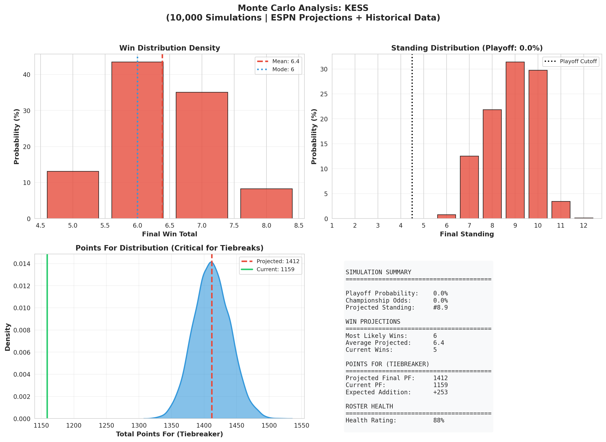

---

### #10 ROUX - Power Score: 20.18

**Record:** 5-9 | **PPG:** 94.25 | **Total PF:** 1319 | **Top6:** 5 | **MVP-W:** 5.18 | **WAX:** -0.18

At #10 with 5-9, the season hasn't gone as planned. Averaging 94.25 PPG with only 5 top-6 finishes in 14 weeks. 

**Projection Summary:** Most likely finish: **5 wins** | Projected PF: **1417** | Playoff: **0.0%** | #1 Seed: **0.0%** 

**Projection Breakdown (Avg Per Game, Weeks 13-15):** 
| Source | Projection | Notes | 
|--------|------------|-------| 
| ESPN Raw | 100.5 pts | ESPN projection (includes BYE/injured starters) | 
| **Optimized** | **100.5 pts** | ESPN Raw - unavailable + bench subs | 
| Historical PPG | 94.2 pts | Season average through week 12 | 
| Monte Carlo Input | 98.0 pts | 60% Optimized + 40% Historical | 

*The computer ran 10,000 simulations and found essentially no path to the playoffs. Time to play spoiler. 1 starter(s) dealing with injuries adds some variance (1.04x) to these projections. Only 0.5 more projected wins suggests a rough finish ahead.* 

**Roster Health & Availability Report:** 
1 minor injury(s) in lineup. 

*Injured Starters (1):* 
- **Chris Rodriguez Jr.** (RB, QUESTIONABLE): 8.6 pts proj, Questionable - assumed to play (historical: 80%+ play rate) 

**Lineup Status:** Optimally set - no BYE week or injury substitutions needed.


**Upcoming Matchups & Roster Decisions:**
 
**Week 15 vs WOOD:**
 | Projection Type | ROUX | WOOD | 
|-----------------|--------|----------| 
| ESPN Raw | 100.5 | 105.3 | 
| Corrected (BYE/Inj=0) | 100.5 | 105.3 | 
| **Optimized (+Bench)** | **100.5** | **105.3** | 
| Historical PPG | 94.2 | 87.8 | 
| **MC Blended** | **98.0** | **98.3** | 

*Expected Outcome:* Toss-up (49% win probability) | Spread: -0.3 

*Roster Decisions:* None needed - lineup is optimally set. 

**Projected Season Totals (Optimized):** 
- Current PF: 1319 
- Expected Additional PF: +98 
- **Projected Final PF: 1417**

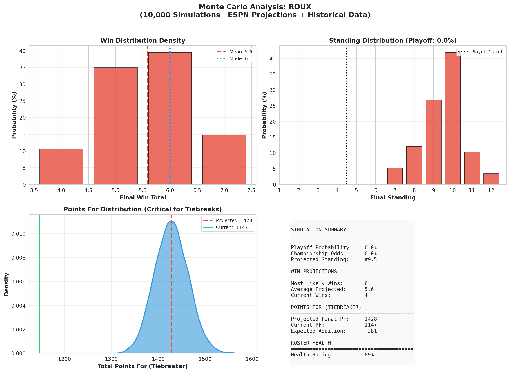

---

### #11 3000 - Power Score: 17.27

**Record:** 4-10 | **PPG:** 92.04 | **Total PF:** 1289 | **Top6:** 4 | **MVP-W:** 5.27 | **WAX:** -1.27

Bringing up the rear at #11 with a 4-10 record. Their 92.04 PPG ranks near the bottom of the league. Only 4 top-6 finishes in 14 weeks tells the story. At least the -1.27 WAX shows they've had some bad luck. 

**Projection Summary:** Most likely finish: **4 wins** | Projected PF: **1385** | Playoff: **0.0%** | #1 Seed: **0.0%** 

**Projection Breakdown (Avg Per Game, Weeks 13-15):** 
| Source | Projection | Notes | 
|--------|------------|-------| 
| ESPN Raw | 99.9 pts | ESPN projection (includes BYE/injured starters) | 
| **Optimized** | **99.9 pts** | ESPN Raw - unavailable + bench subs | 
| Historical PPG | 92.0 pts | Season average through week 12 | 
| Monte Carlo Input | 96.8 pts | 60% Optimized + 40% Historical | 

*The computer ran 10,000 simulations and found essentially no path to the playoffs. Time to play spoiler. 1 starter(s) dealing with injuries adds some variance (1.07x) to these projections. Only 0.2 more projected wins suggests a rough finish ahead.* 

**Roster Health & Availability Report:** 
1 minor injury(s) in lineup. 

*Injured Starters (1):* 
- **Woody Marks** (RB, QUESTIONABLE): 10.2 pts proj, Questionable - assumed to play (historical: 80%+ play rate) 

*Monte Carlo Variance Impact:* Roster uncertainty increased simulation variance by **7%**, widening outcome distributions. This means higher upside but also higher downside risk. 

**Lineup Status:** Optimally set - no BYE week or injury substitutions needed.


**Upcoming Matchups & Roster Decisions:**
 
**Week 15 vs KIRK:**
 | Projection Type | 3000 | KIRK | 
|-----------------|--------|----------| 
| ESPN Raw | 99.9 | 113.6 | 
| Corrected (BYE/Inj=0) | 99.9 | 113.6 | 
| **Optimized (+Bench)** | **99.9** | **113.6** | 
| Historical PPG | 92.0 | 108.9 | 
| **MC Blended** | **96.7** | **111.7** | 

*Expected Outcome:* Underdog (20% win probability) | Spread: -15.0 

*Roster Decisions:* None needed - lineup is optimally set. 

**Projected Season Totals (Optimized):** 
- Current PF: 1289 
- Expected Additional PF: +97 
- **Projected Final PF: 1385**

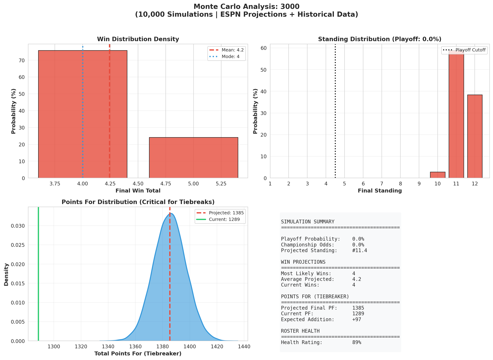

---

### #12 WOOD - Power Score: 16.09

**Record:** 4-10 | **PPG:** 87.80 | **Total PF:** 1229 | **Top6:** 4 | **MVP-W:** 4.09 | **WAX:** -0.09

Bringing up the rear at #12 with a 4-10 record. Their 87.80 PPG ranks near the bottom of the league. Only 4 top-6 finishes in 14 weeks tells the story. 

**Projection Summary:** Most likely finish: **5 wins** | Projected PF: **1328** | Playoff: **0.0%** | #1 Seed: **0.0%** 

**Projection Breakdown (Avg Per Game, Weeks 13-15):** 
| Source | Projection | Notes | 
|--------|------------|-------| 
| ESPN Raw | 105.3 pts | ESPN projection (includes BYE/injured starters) | 
| **Optimized** | **105.3 pts** | ESPN Raw - unavailable + bench subs | 
| Historical PPG | 87.8 pts | Season average through week 12 | 
| Monte Carlo Input | 98.3 pts | 60% Optimized + 40% Historical | 

*The computer ran 10,000 simulations and found essentially no path to the playoffs. Time to play spoiler. Key injuries to Josh Jacobs (QUESTIONABLE) are devastating - the variance multiplier of 1.13x reflects massive uncertainty.* 

**Roster Health & Availability Report:** 
Key injuries: Josh Jacobs (RB, QUESTIONABLE). 

*Injured Starters (3):* 
- **Josh Jacobs** (RB, QUESTIONABLE) ⭐: 19.9 pts proj, Questionable - assumed to play (historical: 80%+ play rate) 
- **Aaron Jones Sr.** (RB, QUESTIONABLE): 11.3 pts proj, Questionable - assumed to play (historical: 80%+ play rate) 
- **Theo Johnson** (WR, QUESTIONABLE): 0.0 pts proj, Questionable - assumed to play (historical: 80%+ play rate) 

*Monte Carlo Variance Impact:* Roster uncertainty increased simulation variance by **13%**, widening outcome distributions. This means higher upside but also higher downside risk. 

**Lineup Status:** Optimally set - no BYE week or injury substitutions needed.


**Upcoming Matchups & Roster Decisions:**
 
**Week 15 vs ROUX:**
 | Projection Type | WOOD | ROUX | 
|-----------------|--------|----------| 
| ESPN Raw | 105.3 | 100.5 | 
| Corrected (BYE/Inj=0) | 105.3 | 100.5 | 
| **Optimized (+Bench)** | **105.3** | **100.5** | 
| Historical PPG | 87.8 | 94.2 | 
| **MC Blended** | **98.3** | **98.0** | 

*Expected Outcome:* Toss-up (51% win probability) | Spread: +0.3 

*Roster Decisions:* None needed - lineup is optimally set. 

**Projected Season Totals (Optimized):** 
- Current PF: 1229 
- Expected Additional PF: +98 
- **Projected Final PF: 1327**

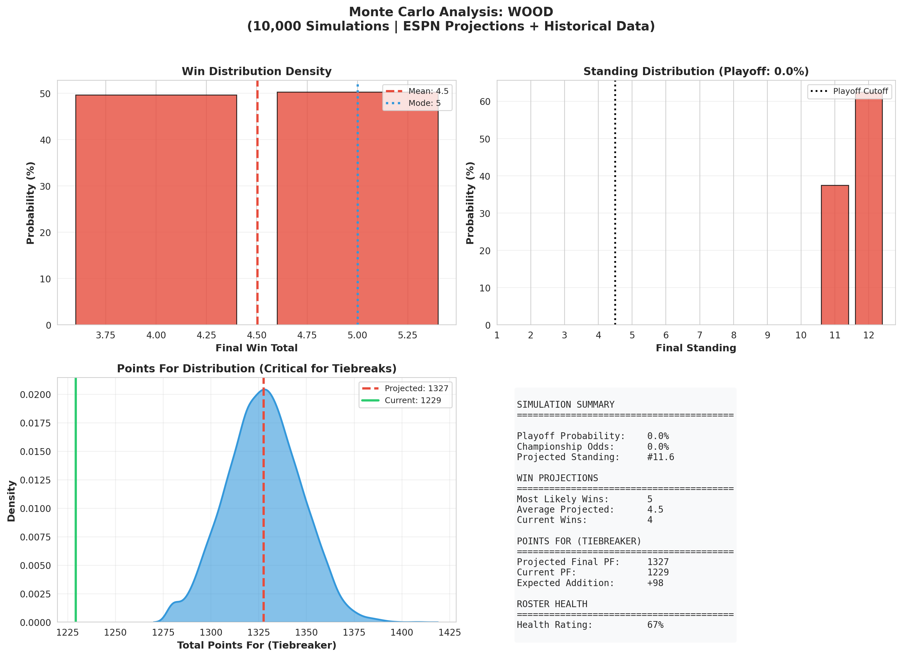

---

## Predicted Final Standings

Based on Monte Carlo simulation with ESPN projections and historical performance:

| Rank | Team | Projected Wins | Projected PF | Current Record | Playoff % |
|------|------|----------------|--------------|----------------|-----------|
| 1 | ZSF | 9.6 | 1776 | 9-5 | 90.7% |
| 2 | MP | 9.5 | 1700 | 9-5 | 91.0% |
| 3 | KIRK | 9.8 | 1637 | 9-5 | 87.3% |
| 4 | sgf | 9.4 | 1633 | 9-5 | 64.6% |
| 5 | GV | 9.6 | 1593 | 9-5 | 63.9% |
| 6 | POO | 8.5 | 1582 | 8-6 | 2.5% |
| 7 | GEMP | 7.4 | 1479 | 7-7 | 0.0% |
| 8 | PATS | 5.7 | 1587 | 5-9 | 0.0% |
| 9 | KESS | 6.3 | 1431 | 6-8 | 0.0% |
| 10 | ROUX | 5.5 | 1417 | 5-9 | 0.0% |
| 11 | 3000 | 4.2 | 1385 | 4-10 | 0.0% |
| 12 | WOOD | 4.5 | 1328 | 4-10 | 0.0% |

---

## Projected Playoff Matchups

*If playoffs started today (top 4 make it, seeded by record then Points For):*

**Semifinal 1:** #1 ZSF (Proj. PF: 1776) vs #4 sgf (Proj. PF: 1633)

**Semifinal 2:** #2 MP (Proj. PF: 1700) vs #3 KIRK (Proj. PF: 1637)

---

## Data Sources & Methodology

| Component | Source | Weight |
|-----------|--------|--------|
| Weekly Projections | ESPN Fantasy API | 60% |
| Historical Performance | Season-to-date PPG | 40% |
| Scoring Variance | Season standard deviation | Adjusted for injuries |
| Roster Health | ESPN Injury Designations | Increases variance |
| Tiebreaker | Total Points For | League Setting |

---

*Analysis generated by ESPN Fantasy Football Scraper using 10,000 Monte Carlo simulations. May your players stay healthy and your opponents' stars have bye weeks.*
