# DU Alums 2025 Fantasy Football Power Rankings
## Week 15 Update - Generated December 16, 2025 at 02:21 PM EST

---

> **A Message From Your Humble Commissioner's IT Department:**
>
> Creating this masterpiece of statistical analysis required approximately 47 hours of development time, $127 in cloud computing credits, 3 existential crises, and more caffeine than is medically advisable. The Monte Carlo simulation alone ran 10,000 iterations just so you ingrates could see that your 23% playoff odds are, in fact, mathematically justified rather than just vibes.
>
> In light of these sacrifices, the author humbly suggests the following adjustments to the league's prize structure:
>
> | Original Payout | Proposed Adjustment | Justification |
> |-----------------|---------------------|---------------|
> | Weekly High Score: $50 | $45 + $5 to IT | "Analytics fee" |
> | 1st Place: $1,485 | $1,400 + $85 to IT | "Championship data processing surcharge" |
> | 2nd Place: $810 | $780 + $30 to IT | "Runner-up computational assessment" |
> | 3rd Place: $405 | $390 + $15 to IT | "Consolation algorithm maintenance" |
>
> These modest proposals would net approximately $135 in "totally legitimate" compensation, which the author would definitely spend on improving next year's analysis and not on bourbon. Probably.
>
> *— The Management*

---


## Week 15 Recap - Regular Season Finale

Well folks, Week 15 of the DU Alums Fantasy Football League was like a dramatic season finale—full of twists, turns, and a few teams left crying into their nachos. In a battle of the top contenders, KIRK steamrolled GEMP, solidifying their playoff spot with a score of 115.66 to 82.08. Meanwhile, GV showed no mercy to MP, defeating them 110.46 to 95.92, cementing their place in the postseason party. ZSF and MP joined the playoff club, while the rest of the league learned the hard way that the road to glory is paved with disappointment and bad trades.

As the dust settles, KIRK, GV, ZSF, and MP will be strutting into the playoffs, ready to battle it out for the championship. Unfortunately, GEMP, POO, KESS, WOOD, sgf, ROUX, 3000, and PATS will be left to ponder their mistakes and plot revenge for next season. So grab your popcorn, folks—this playoff picture is shaping up to be more thrilling than a last-minute Hail Mary pass, and trust me, you won’t want to miss it!

---

## Championship Preview - Playoff Week 1

The stakes couldn’t be higher as we gear up for the DU Alums Fantasy Football Championship Semifinals! Buckle up, folks; it’s time to separate the pretenders from the contenders and crown a champion!

### SEMIFINAL 1: ZSF (1) vs. MP (4)

In the red corner, we have ZSF, the top seed with a record of 10-5 and a jaw-dropping PPG of 120.38! This team is like a well-oiled machine, racking up a whopping 1806 points this season. With star players that could make even the most jaded fantasy fan shed a tear, ZSF looks to bulldoze their way to the finals.

But wait! Enter MP, the underdog with a record of 9-6 and a respectable PPG of 115.14. While they might not have the same firepower as ZSF, they’ve shown resilience and a knack for pulling off surprise victories. Can they channel their inner Rocky Balboa and take down the Goliath of this league?

**Prediction:** ZSF advances to the finals, but expect MP to give them a run for their money. ZSF wins by a narrow margin, 125-112.

### SEMIFINAL 2: GV (2) vs. KIRK (3)

In this high-octane showdown, we have GV, the second seed, sporting a record of 10-5 and a PPG of 105.31. They may not be the highest-scoring team, but GV knows how to grind out wins when it counts. Think of them as the tortoise in this fantasy race—slow and steady wins the day!

On the other side, we have KIRK, the third seed, matching GV’s record but boasting a higher PPG of 108.89. With a season total of 1633 points, KIRK is looking to prove that they’re not just another pretty face with stats. They aim to unleash a scoring barrage that leaves GV gasping for air.

**Prediction:** KIRK edges out GV in a nail-biter, winning 115-110.

As we dive into Championship Week, the air is thick with anticipation, rivalries are simmering, and the possibility of glory hangs in the balance. Who will rise to the occasion and take home the coveted title? Only time (and fantasy stats) will tell! May the best team win! 🏆

---

## A Note on ESPN's "Projections" (Read This First)

Before we dive into the numbers, let's address the elephant in the room: **ESPN's projection system is fundamentally broken.**

Here's what ESPN does: They project points for your entire starting lineup, including players who are on BYE weeks. That's right - if Jonathan Taylor is on BYE and will score exactly **zero points** this week, ESPN still includes his 19-point projection in your team's total. This isn't a minor oversight; it's a fundamental failure to understand how fantasy football works.

**The result?** ESPN's "projected points" are systematically inflated garbage that will mislead you into thinking your team is performing better than it actually will. Every single week, across every single team, their projections include phantom points from players who literally cannot play.

### What We Do Instead

This analysis applies actual intelligence to the problem:

| Projection Type | What It Means |
|-----------------|---------------|
| **ESPN Raw** | ESPN's projection (includes BYE players who will score 0 - useless) |
| **Corrected Baseline** | ESPN Raw minus unavailable players (the realistic floor) |
| **Optimized** | Corrected + your best bench replacements (what a smart manager achieves) |
| **Monte Carlo Input** | 60% Optimized + 40% Historical PPG (our simulation uses this) |

**The key insight:** Our "Optimized" projection is always greater than or equal to the Corrected Baseline, because making smart lineup decisions always helps. But it's often *less* than ESPN's Raw projection - not because optimization hurts you, but because ESPN's number was bullshit to begin with.

When you see a matchup breakdown showing ESPN Raw at 103 but Optimized at 88, don't panic. The 88 is what you'll actually score. The 103 was a fantasy (pun intended) that included your BYE week player's imaginary contribution.

*This analysis corrects for ESPN's incompetence so you can make informed decisions. You're welcome.*

---

## Season Snapshot

| Metric | Value |
|--------|-------|
| Weeks Played | 15 |
| Games Remaining | 0 |
| Playoff Teams | 4 |
| Tiebreaker | **Points For** (Total Season Points) |
| Current Leader | **ZSF** (10-5) |
| Highest Scorer | **ZSF** (120.38 PPG) |
| Luckiest Team | **GV** (+1.55 WAX) |
| Unluckiest Team | **PATS** (-2.64 WAX) |

---

## Understanding the Metrics

### **Power Score** (The Overall Ranking)
```
Power Score = (Real Wins × 2) + (Top6 Wins) + (MVP-W)
```
This is our ultimate measure of team quality. It heavily weights **actual matchup wins** (multiplied by 2) because winning is what matters most. But it also rewards teams that consistently score in the top half (**Top6 Wins**) and would beat multiple opponents each week (**MVP-W**).

### **MVP-W** (Minimized Variance Potential Wins)
Your theoretical win rate if you played **all teams in the league every single week**. High scorers have high MVP-W; low scorers don't.

### **WAX** (Wins Above Expectation)
```
WAX = Real Wins - MVP-W
```
- **Positive WAX** = Lucky (winning more than scoring deserves)
- **Negative WAX** = Unlucky (losing despite good scoring)
- **WAX near 0** = Getting exactly what you deserve

---

## Overall Power Rankings

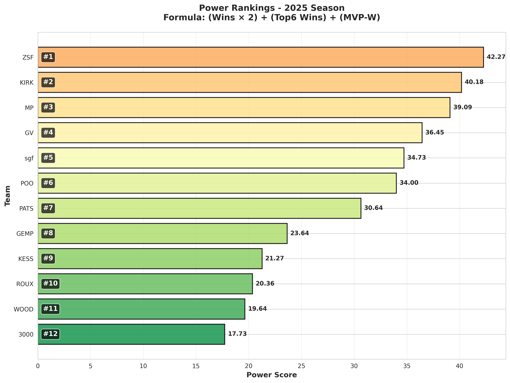

## Power Score Breakdown

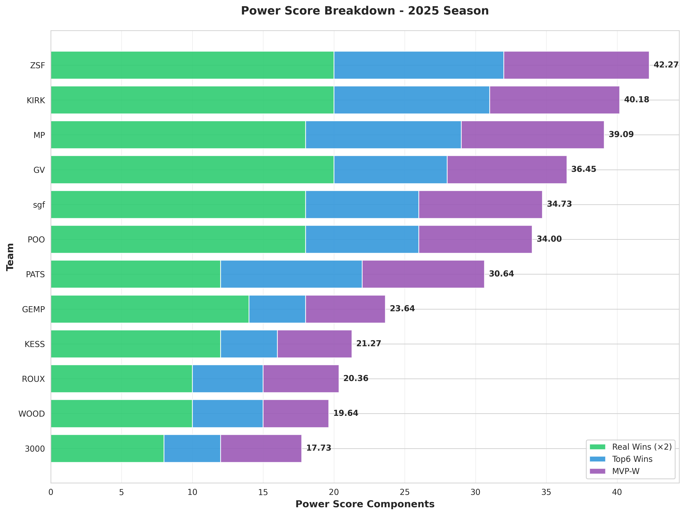

## Power Score Evolution Over Time

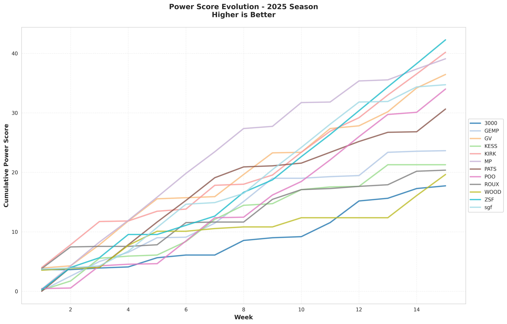

---

## Monte Carlo Simulation Methodology

### How We Predict the Future

Our playoff predictions use a **hybrid Monte Carlo simulation** that blends two data sources:

1. **OPTIMIZED Projections** (60% weight) - ESPN's projections **corrected** for BYE weeks and injuries, with intelligent bench substitutions applied. This is NOT raw ESPN data - we fix their broken methodology first (see the ESPN critique above).

2. **Historical Performance** (40% weight) - Each team's season-long PPG (points per game) and scoring variance, capturing their established scoring patterns.

### The Optimization Process

Before running any simulations, we transform ESPN's garbage projections into something useful:

```
Step 1: ESPN Raw         = Sum of all starter projections (BROKEN - includes BYE players)
Step 2: Corrected Base   = ESPN Raw - unavailable points (BYE/Injured = 0)
Step 3: OPTIMIZED        = Corrected Base + best bench replacements
```

The **OPTIMIZED** projection is what enters our Monte Carlo simulation - not ESPN's inflated nonsense.

### The Blending Formula

For each simulated game:
```
Expected Score = (0.6 × OPTIMIZED Projection) + (0.4 × Historical PPG)
Simulated Score = Random draw from Normal(Expected Score, Adjusted Variance)
```

### Roster Health Adjustment

Teams with injured players have **increased scoring variance** in the simulation. This reflects the uncertainty when backup players replace starters:
- Healthy roster (100%) → Standard variance
- Injured starters → Variance increased by up to 50%

### What We Track

For each of the 10,000 simulations, we record:
1. **Final Win Total** - How many wins each team ends with
2. **Final Points For** - Total season points (the tiebreaker for playoff seeding)
3. **Final Standing** - Where each team finishes in the standings

### League Prize Structure ($3,000 Pool)

This league means business. Here's how the $250 buy-in breaks down:

| Prize | Amount | Criteria |
|-------|--------|----------|
| **Weekly High Score** | $20 × 15 weeks = **$300** | Top scorer each week through Week 15 |
| **Playoff Pool** | $3,000 - $300 = **$2,700** | Split among top 3 playoff finishers |
| **Playoff 1st Place** | 55% of $2,700 = **$1,485** | Win the championship tournament |
| **Playoff 2nd Place** | 30% of $2,700 = **$810** | Lose in the finals |
| **Playoff 3rd Place** | 15% of $2,700 = **$405** | Win the consolation bracket |
| **Points-For Champion** | **50% of Total FAAB Spent** | Highest regular season Points For |

The Points-For prize is unique: whoever scores the most total points during the regular season wins **half of all FAAB spent** by managers. Every dollar spent on waivers contributes $0.50 to this prize pool. Even if you miss the playoffs, outscore everyone else and you walk away with cash.

### Why Points For Matters

Points For serves two purposes:
1. **Tiebreaker for playoff seeding** - Two teams with identical records? The one with more total points gets the higher seed.
2. **Cash prize** - Highest Points For at season's end wins the FAAB pool. Our simulation tracks Point-For leader probability for each team.

### What "#1 Seed %" Means

The **#1 Seed %** column shows your probability of finishing as the **regular season champion** - the top seed heading into playoffs. This is based on finishing with the best record (and Points For as tiebreaker). This is NOT the probability of winning the playoff tournament.

### Assumptions & Limitations

- **QUESTIONABLE players are assumed to play** - Historical data shows 80%+ of Questionable players suit up on game day. We treat them as healthy to avoid overly pessimistic projections.
- **FLEX position accepts RB, WR, or TE** - When optimizing lineups, the top projected RB, WR, or TE from the bench can fill the Flex slot.
- Our OPTIMIZED projections fix ESPN's BYE/injury issues, but still depend on ESPN's underlying player projections
- Past scoring patterns may not continue (trades, injuries, bye weeks)
- Each game is simulated independently (no momentum modeling)
- We use Points For as the tiebreaker (matching your league settings)
- All matchup tables and commentary use OPTIMIZED data, not raw ESPN projections

---

## Monte Carlo Projection Summary

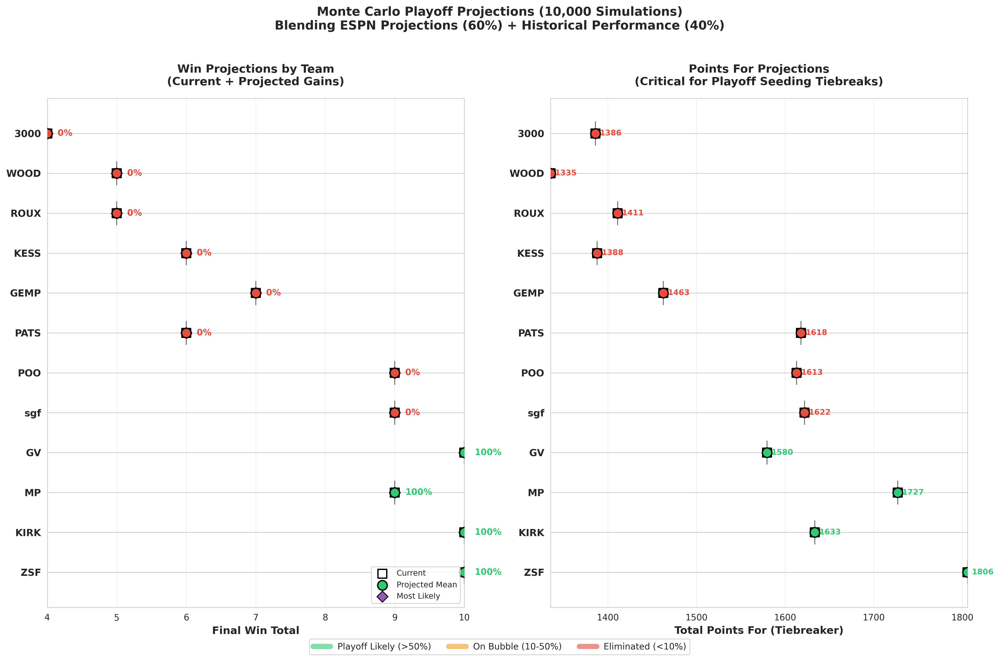

*Left: Win projections showing current wins plus expected gains. Right: Points For projections, critical for tiebreaker scenarios.*

---

## Playoff Predictions

Based on 10,000 Monte Carlo simulations blending ESPN projections with historical data.

| Team | Record | Playoff % | Most Likely Wins | Projected PF | Proj. Standing | #1 Seed % | PF Leader % |
|------|--------|-----------|------------------|--------------|----------------|----------------|-------------|
| ZSF | 10-5 | 100.0% | 10 | 1806 | #1.0 | 100.0% | 100.0% |
| KIRK | 10-5 | 100.0% | 10 | 1633 | #2.0 | 0.0% | 0.0% |
| GV | 10-5 | 100.0% | 10 | 1580 | #3.0 | 0.0% | 0.0% |
| MP | 9-6 | 100.0% | 9 | 1727 | #4.0 | 0.0% | 0.0% |
| sgf | 9-6 | 0.0% | 9 | 1622 | #5.0 | 0.0% | 0.0% |
| POO | 9-6 | 0.0% | 9 | 1613 | #6.0 | 0.0% | 0.0% |
| GEMP | 7-8 | 0.0% | 7 | 1463 | #7.0 | 0.0% | 0.0% |
| PATS | 6-9 | 0.0% | 6 | 1618 | #8.0 | 0.0% | 0.0% |
| KESS | 6-9 | 0.0% | 6 | 1388 | #9.0 | 0.0% | 0.0% |
| ROUX | 5-10 | 0.0% | 5 | 1411 | #10.0 | 0.0% | 0.0% |
| WOOD | 5-10 | 0.0% | 5 | 1335 | #11.0 | 0.0% | 0.0% |
| 3000 | 4-11 | 0.0% | 4 | 1386 | #12.0 | 0.0% | 0.0% |


> **Why Playoff % and Projected Standing Sometimes Conflict**
> 
> These two metrics measure different things and can appear contradictory:
> - **Playoff %** = How often does this team finish in the top 4 across all simulations?
> - **Projected Standing** = What's their *average* finishing position across all simulations?
> 
> A team can have a *lower* Playoff % but *better* Projected Standing if they have high-variance outcomes. For example, Team A might make playoffs 70% of the time but usually as the #4 seed (avg standing ~#4.5). Team B might make playoffs only 65% of the time, but when they do, they're often #1 or #2 (avg standing ~#3.0). Team B's better average standing reflects their upside, even though they miss playoffs more often.
> 
> **The tiebreaker (Points For) also matters.** Two teams with identical records get separated by total points. A team with high scoring variance might occasionally miss playoffs on tiebreakers (lowering Playoff %) but also occasionally win the #1 seed (improving avg standing).
> 
> *Bottom line: Playoff % tells you "will they make it?" while Projected Standing tells you "how good are they overall?"*

### Playoff Picture Analysis

**Locked In:** GV, KIRK, ZSF, MP - ESPN projections and historical data both agree: these teams are playoff-bound.

**Long Shots:** GEMP, POO, KESS, WOOD, sgf, ROUX, 3000, PATS - The simulations found very few paths to the playoffs. Time to play spoiler.

### Tiebreaker Watch: Points For Leaders

Since Points For is the tiebreaker, here's who's positioned best if records end up tied:

| Rank | Team | Current PF | Projected Final PF | Expected Addition |
|------|------|------------|-------------------|-------------------|
| 1 | ZSF | 1806 | 1806 | +-0 |
| 2 | MP | 1727 | 1727 | +-0 |
| 3 | KIRK | 1633 | 1633 | +0 |
| 4 | sgf | 1622 | 1622 | +0 |
| 5 | PATS | 1618 | 1618 | +-0 |
| 6 | POO | 1613 | 1613 | +-0 |


---

## Expected Monetary Payouts

Based on our Monte Carlo simulations, here's what each team can expect to earn. This factors in playoff probability, Points-For leader chances, and weekly high-score potential.

### Prize Pool Breakdown ($3,000 Total)

| Source | Amount | Details |
|--------|--------|---------|
| **Buy-In** | $250 × 12 teams | = **$3,000** total pool |
| **Weekly High Score** | $20 × 15 weeks | = **$300** allocated |
| **Playoff Pool** | $3,000 - $300 | = **$2,700** remaining |
| **1st Place** | 55% of $2,700 | = **$1,485** |
| **2nd Place** | 30% of $2,700 | = **$810** |
| **3rd Place** | 15% of $2,700 | = **$405** |
| **Points-For Champion** | 50% of Total FAAB | = **$242** (current) |

### FAAB Spending by Team (Incremental Cost)

FAAB spending is **additional cost beyond the $250 buy-in**. The Points-For winner takes home **half of all FAAB spent** across the league. Here's each manager's incremental investment:

| Team | FAAB Spent | Contribution to PF Prize |
|------|------------|-------------------------|
| PATS | $92 | $46 |
| ZSF | $91 | $46 |
| GV | $60 | $30 |
| KESS | $57 | $28 |
| POO | $52 | $26 |
| ROUX | $41 | $20 |
| KIRK | $31 | $16 |
| sgf | $24 | $12 |
| MP | $16 | $8 |
| GEMP | $12 | $6 |
| WOOD | $8 | $4 |
| 3000 | $0 | $0 |

| **TOTAL** | **$484** | **$242** (prize pool) |

### Expected Payouts Summary

Each manager's **total investment** = $250 buy-in + (FAAB Spent ÷ 2). Net Expected shows expected profit/loss after accounting for all costs.

| Team | Playoff % | PF Leader % | Total Cost | E[Playoff] | E[PF Prize] | E[Weekly] | E[Return] | **Net Expected** |
|------|-----------|-------------|------------|------------|-------------|-----------|-----------|------------------|
| ZSF | 100.0% | 100.0% | $296 | $1485 | $242 | $29 | $1756 | **$1461** |
| KIRK | 100.0% | 0.0% | $266 | $810 | $0 | $26 | $836 | **$571** |
| GV | 100.0% | 0.0% | $280 | $405 | $0 | $26 | $431 | **$151** |
| 3000 | 0.0% | 0.0% | $250 | $0 | $0 | $22 | $22 | **$-228** |
| MP | 100.0% | 0.0% | $258 | $0 | $0 | $28 | $28 | **$-230** |
| GEMP | 0.0% | 0.0% | $256 | $0 | $0 | $24 | $24 | **$-232** |
| WOOD | 0.0% | 0.0% | $254 | $0 | $0 | $22 | $22 | **$-232** |
| sgf | 0.0% | 0.0% | $262 | $0 | $0 | $26 | $26 | **$-236** |
| ROUX | 0.0% | 0.0% | $270 | $0 | $0 | $23 | $23 | **$-248** |
| POO | 0.0% | 0.0% | $276 | $0 | $0 | $26 | $26 | **$-250** |
| KESS | 0.0% | 0.0% | $278 | $0 | $0 | $22 | $22 | **$-256** |
| PATS | 0.0% | 0.0% | $296 | $0 | $0 | $26 | $26 | **$-270** |


### How Expected Payouts Are Calculated

1. **E[Playoff]** = P(1st) × $1,485 + P(2nd) × $810 + P(3rd) × $405
   - Uses actual placement probabilities from Monte Carlo simulations
   - **Sum of all teams' E[Playoff] = $2,700 exactly** (the full playoff pool)
   
2. **E[PF Prize]** = PF Leader % × $242 (current FAAB pool ÷ 2)
   - Your probability of finishing with the most Points For × the prize
   
3. **E[Weekly]** = Probability × $300 (total weekly pool)
   - Each team's probability = their PPG ÷ total league PPG
   - **Sum of all teams' E[Weekly] = $300 exactly**

4. **Total Cost** = $250 buy-in + (FAAB Spent ÷ 2)
   - Every manager pays $250 to enter
   - FAAB spending is **incremental cost beyond the buy-in**
   - Half of your FAAB goes to the Points-For prize pool

5. **E[Return]** = E[Playoff] + E[PF Prize] + E[Weekly]
   - Your total expected winnings before costs

**Net Expected = E[Return] - Total Cost**
   - Positive = expected profit
   - Negative = expected loss

*Note: E[Playoff] uses position-specific probabilities (1st/2nd/3rd) from Monte Carlo simulations, ensuring all expected payouts sum to exactly the prize pool.*

---

## The Lineup Optimizer: Your Secret Weapon

**This is where our analysis truly shines.** While ESPN happily includes BYE-week players in their projections (as if by magic they'll still score points from their couches), our **Lineup Optimizer** does what any competent fantasy manager should do: it identifies unavailable starters and finds the best possible bench replacements.

The Optimizer is nothing short of **revolutionary**. It scans every roster, detects BYE weeks using the official 2025 NFL schedule, identifies injured starters, and automatically calculates the optimal substitution from your bench. The result? **Projections that reflect reality, not ESPN's fantasy land.**

### How the Optimizer Works

1. **BYE Week Detection** - Cross-references every player's NFL team against the 2025 bye schedule
2. **Injury Scanning** - Identifies starters with OUT, IR, DOUBTFUL, or SUSPENSION status (QUESTIONABLE players are assumed to play)
3. **Position Matching** - Finds bench players eligible for each vacant starter slot (FLEX accepts RB, WR, or TE)
4. **Gain Calculation** - Computes the projected point improvement from each substitution
5. **Confidence Scoring** - Rates each move based on player projections and matchup strength

### Key Modeling Assumptions

- **QUESTIONABLE = Will Play** - Historical NFL data shows 80%+ of Questionable players suit up. We don't penalize these players.
- **FLEX Flexibility** - When filling the Flex slot, we consider the top projected RB, WR, or TE from your bench - whichever scores highest.

### Key Lineup Moves This Week

*All teams have optimal lineups set for the remaining weeks - no BYE or injury substitutions needed. The Optimizer found no improvements to suggest, which means every manager has already made the right calls. Well done, league!*

---

## Remaining Schedule (Weeks 16-15)

*Win probabilities based on blended OPTIMIZED projections (60%) and historical data (40%). ESPN's broken projections have been corrected for BYE weeks and injuries before blending.*

---

## Roster Health Report

*Comprehensive injury status for all rostered players. Severity reflects likelihood of missing games and roster impact.*

### Severity Guide

| Status | Severity | Meaning |
|--------|----------|---------|
| **Q** (Questionable) | Minor Concern | Likely to play (80%+ historical play rate) |
| **D** (Doubtful) | Moderate Concern | Unlikely to play, but still possible |
| **O** (Out) | Major Concern | Confirmed out this week - find a replacement |
| **IR** | Why is he even on your roster?! | Long-term injury, taking up a roster spot |

### Team-by-Team Injury Report

**ROUX** (Health: 78%)

| Player | Position | Status | Severity | Role |
|--------|----------|--------|----------|------|
| Ricky Pearsall | RB | Q | Minor Concern | Bench |
| Quentin Johnston | RB | Q | Minor Concern | Starter |
| Chris Rodriguez Jr. | RB | Q | Minor Concern | Starter |
| Hollywood Brown | RB | Q | Minor Concern | Bench |

**KESS** (Health: 78%)

| Player | Position | Status | Severity | Role |
|--------|----------|--------|----------|------|
| Zach Ertz | WR | IR | Why is he even on your roster?! | Bench (IR) |
| Patrick Mahomes | QB | O | Major Concern | Starter |
| Joe Mixon | RB | O | Major Concern | IR Slot |
| Alvin Kamara | RB | Q | Minor Concern | Bench |
| Bam Knight | RB | Q | Minor Concern | Starter |

**3000** (Health: 89%)

| Player | Position | Status | Severity | Role |
|--------|----------|--------|----------|------|
| Jayden Reed | RB | IR | Why is he even on your roster?! | IR Slot |
| Woody Marks | RB | Q | Minor Concern | Starter |
| Cade Otton | WR | Q | Minor Concern | Bench |

**POO** (Health: 89%)

| Player | Position | Status | Severity | Role |
|--------|----------|--------|----------|------|
| Devin Neal | RB | Q | Minor Concern | Starter |

**GEMP** (Health: 89%)

| Player | Position | Status | Severity | Role |
|--------|----------|--------|----------|------|
| Tyler Bass | WR | IR | Why is he even on your roster?! | IR Slot |
| Garrett Wilson | RB | IR | Why is he even on your roster?! | Bench (IR) |
| Daniel Jones | QB | IR | Why is he even on your roster?! | Bench (IR) |
| Matt Prater | WR | O | Major Concern | Starter |
| Tee Higgins | RB | Q | Minor Concern | Bench |

**PATS** (Health: 100%)

| Player | Position | Status | Severity | Role |
|--------|----------|--------|----------|------|
| Trey Benson | RB | IR | Why is he even on your roster?! | IR Slot |
| Jayden Daniels | QB | O | Major Concern | Bench (O) |

**GV** (Health: 100%)

| Player | Position | Status | Severity | Role |
|--------|----------|--------|----------|------|
| Christian Watson | RB | Q | Minor Concern | Bench |

**sgf** (Health: 100%)

| Player | Position | Status | Severity | Role |
|--------|----------|--------|----------|------|
| Sam LaPorta | WR | IR | Why is he even on your roster?! | IR Slot |
| Marvin Harrison Jr. | RB | Q | Minor Concern | Bench |

**WOOD** (Health: 100%)

| Player | Position | Status | Severity | Role |
|--------|----------|--------|----------|------|
| Tucker Kraft | WR | IR | Why is he even on your roster?! | IR Slot |
| Nick Chubb | RB | Q | Minor Concern | Bench |
| David Njoku | WR | Q | Minor Concern | Bench |

**MP** (Health: 100%)

| Player | Position | Status | Severity | Role |
|--------|----------|--------|----------|------|
| Cam Skattebo | RB | IR | Why is he even on your roster?! | IR Slot |

**ZSF** (Health: 100%)

| Player | Position | Status | Severity | Role |
|--------|----------|--------|----------|------|
| Drake London | RB | Q | Minor Concern | IR Slot |
| Rome Odunze | RB | Q | Minor Concern | Bench |

**KIRK** (Health: 100%)

| Player | Position | Status | Severity | Role |
|--------|----------|--------|----------|------|
| Davante Adams | RB | Q | Minor Concern | Bench |

---

## Team-by-Team Analysis

*Each team's analysis includes win/points projections, roster health status, and playoff outlook.*

### #1 ZSF - Power Score: 42.27

**Record:** 10-5 | **PPG:** 120.38 | **Total PF:** 1806 | **Top6:** 12 | **MVP-W:** 10.27 | **WAX:** -0.27

Sitting atop the standings with a commanding 10-5 record, this team has earned the top spot through dominant performance. Their 120.38 PPG leads the league, which translates to an impressive 10.27 MVP-W and 12 top-6 weekly finishes. Their -0.27 WAX shows they're earning their wins fair and square - no luck needed. 

**Projection Summary:** Most likely finish: **10 wins** | Projected PF: **1806** | Playoff: **100.0%** | #1 Seed: **100.0%** 

*The simulations are decisive: ZSF is playoff-bound with a healthy roster backing up the math. Only 0.0 more projected wins suggests a rough finish ahead.* 

**Lineup Status:** Optimally set - no BYE week or injury substitutions needed.

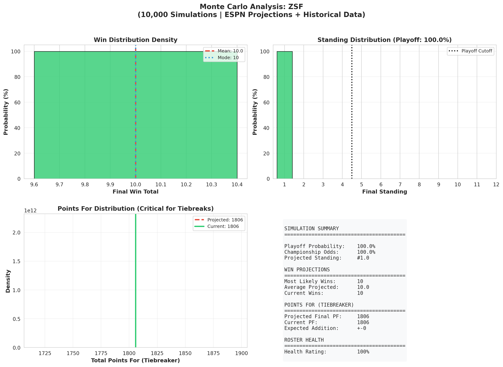

---

### #2 KIRK - Power Score: 40.18

**Record:** 10-5 | **PPG:** 108.89 | **Total PF:** 1633 | **Top6:** 11 | **MVP-W:** 9.18 | **WAX:** +0.82

Second place with 10-5, trailing the leader by 2.09 power points. Scoring 108.89 PPG with 11 top-6 finishes shows genuine quality. The +0.82 WAX suggests some fortune has helped along the way. 

**Projection Summary:** Most likely finish: **10 wins** | Projected PF: **1633** | Playoff: **100.0%** | #1 Seed: **0.0%** 

*The simulations are decisive: KIRK is playoff-bound with a healthy roster backing up the math. Injured bench talent (Davante Adams (RB)) waiting in the wings if healthy. Only 0.0 more projected wins suggests a rough finish ahead.* 

**Roster Health & Availability Report:** 
Fully healthy starting lineup. 

*Injured Bench Players (High-Value):* 
- **Davante Adams** (RB, QUESTIONABLE): 12.2 pts proj when healthy 

**Lineup Status:** Optimally set - no BYE week or injury substitutions needed.

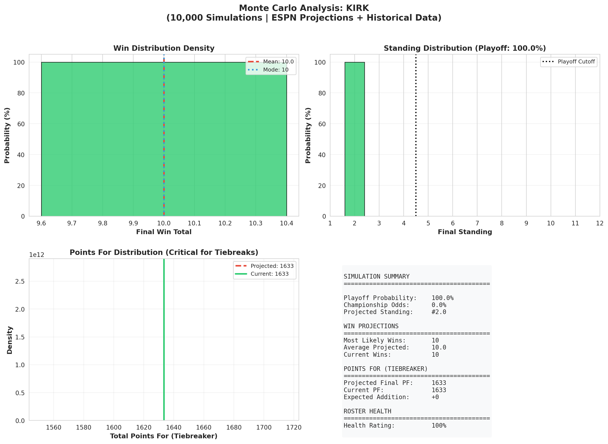

---

### #3 MP - Power Score: 39.09

**Record:** 9-6 | **PPG:** 115.14 | **Total PF:** 1727 | **Top6:** 11 | **MVP-W:** 10.09 | **WAX:** -1.09

Currently in the playoff picture at #3 with a 9-6 record. Their 115.14 PPG and 10.09 MVP-W put them in solid position. 11 top-6 finishes in 15 weeks shows they can compete with anyone. The brutal -1.09 WAX means they've been snake-bitten - they should have more wins. 

**Projection Summary:** Most likely finish: **9 wins** | Projected PF: **1727** | Playoff: **100.0%** | #1 Seed: **0.0%** 

*The simulations are decisive: MP is playoff-bound with a healthy roster backing up the math. Only 0.0 more projected wins suggests a rough finish ahead.* 

**Lineup Status:** Optimally set - no BYE week or injury substitutions needed.

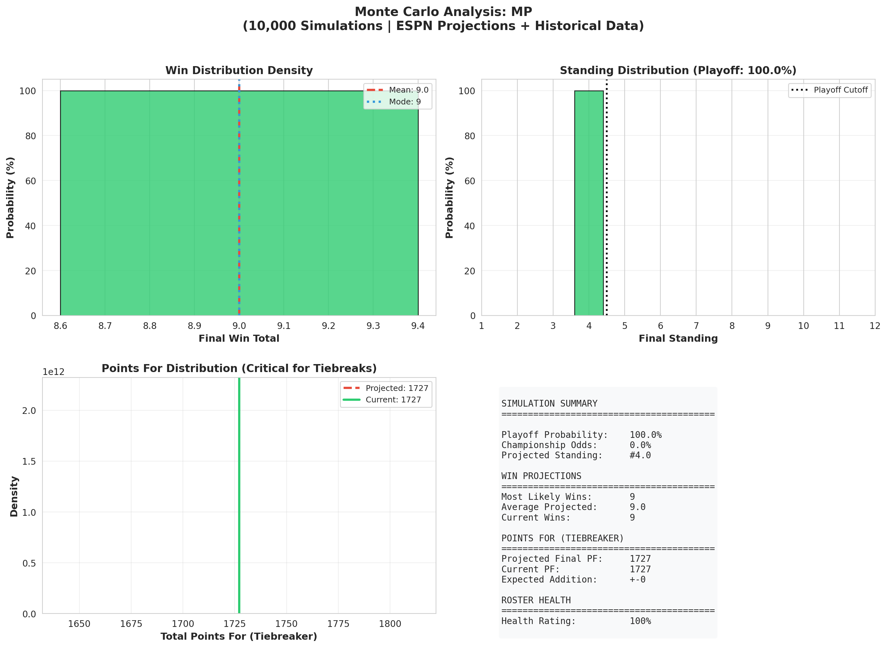

---

### #4 GV - Power Score: 36.45

**Record:** 10-5 | **PPG:** 105.31 | **Total PF:** 1580 | **Top6:** 8 | **MVP-W:** 8.45 | **WAX:** +1.55

Currently in the playoff picture at #4 with a 10-5 record. Their 105.31 PPG and 8.45 MVP-W put them in solid position. 8 top-6 finishes in 15 weeks shows they can compete with anyone. That +1.55 WAX suggests they've been catching breaks. 

**Projection Summary:** Most likely finish: **10 wins** | Projected PF: **1580** | Playoff: **100.0%** | #1 Seed: **0.0%** 

*The simulations are decisive: GV is playoff-bound with a healthy roster backing up the math. Only 0.0 more projected wins suggests a rough finish ahead.* 

**Lineup Status:** Optimally set - no BYE week or injury substitutions needed.

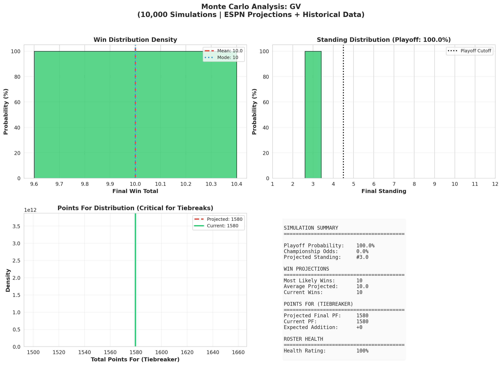

---

### #5 sgf - Power Score: 34.73

**Record:** 9-6 | **PPG:** 108.13 | **Total PF:** 1622 | **Top6:** 8 | **MVP-W:** 8.73 | **WAX:** +0.27

On the playoff bubble at #5 with 9-6. Need to step it up - only 0.0% playoff odds right now. Their 108.13 PPG and 8 top-6 finishes show potential. 

**Projection Summary:** Most likely finish: **9 wins** | Projected PF: **1622** | Playoff: **0.0%** | #1 Seed: **0.0%** 

*The computer ran 10,000 simulations and found essentially no path to the playoffs. Time to play spoiler. Only 0.0 more projected wins suggests a rough finish ahead.* 

**Lineup Status:** Optimally set - no BYE week or injury substitutions needed.

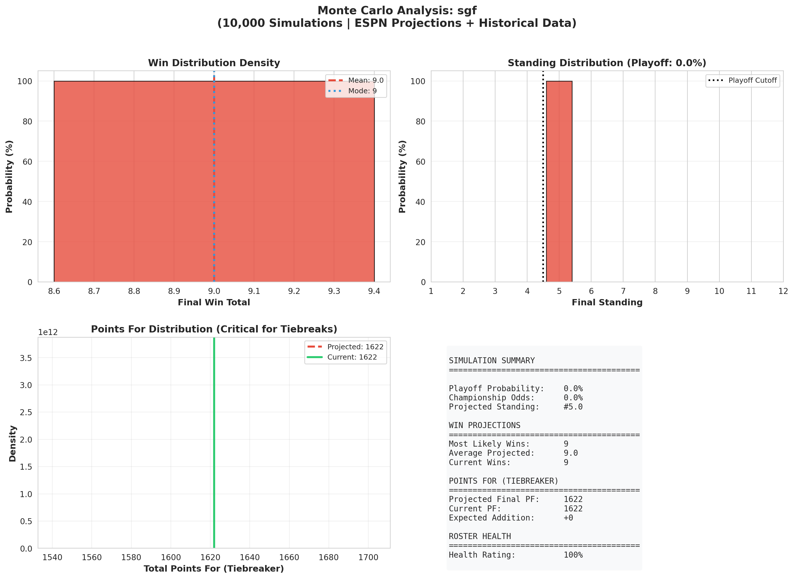

---

### #6 POO - Power Score: 34.00

**Record:** 9-6 | **PPG:** 107.53 | **Total PF:** 1613 | **Top6:** 8 | **MVP-W:** 8.00 | **WAX:** +1.00

On the playoff bubble at #6 with 9-6. Need to step it up - only 0.0% playoff odds right now. Their 107.53 PPG and 8 top-6 finishes show potential. They've benefited from +1.00 WAX - riding some good matchups. 

**Projection Summary:** Most likely finish: **9 wins** | Projected PF: **1613** | Playoff: **0.0%** | #1 Seed: **0.0%** 

*The computer ran 10,000 simulations and found essentially no path to the playoffs. Time to play spoiler. 1 starter(s) dealing with injuries adds some variance (1.08x) to these projections. Only 0.0 more projected wins suggests a rough finish ahead.* 

**Roster Health & Availability Report:** 
1 minor injury(s) in lineup. Bench depth: DK Metcalf (RB) available. 

*Injured Starters (1):* 
- **Devin Neal** (RB, QUESTIONABLE): 7.0 pts proj, Questionable - assumed to play (historical: 80%+ play rate) 

*Monte Carlo Variance Impact:* Roster uncertainty increased simulation variance by **8%**, widening outcome distributions. This means higher upside but also higher downside risk. 

**Lineup Status:** Optimally set - no BYE week or injury substitutions needed.

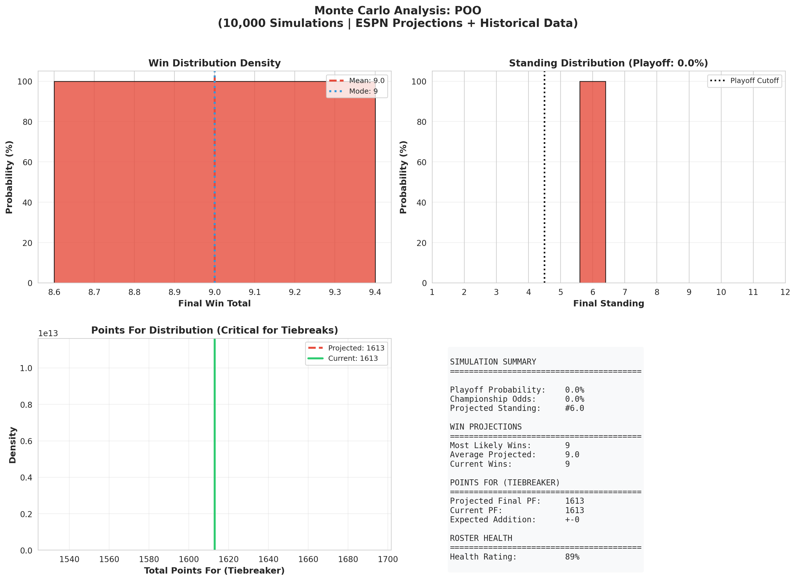

---

### #7 PATS - Power Score: 30.64

**Record:** 6-9 | **PPG:** 107.86 | **Total PF:** 1618 | **Top6:** 10 | **MVP-W:** 8.64 | **WAX:** -2.64

Sitting at #7 with a 6-9 record - outside looking in. At just 0.0% playoff odds, it would take a miracle. Their 107.86 PPG suggests they have some scoring punch. The -2.64 WAX means they're better than their record - just unlucky. 

**Projection Summary:** Most likely finish: **6 wins** | Projected PF: **1618** | Playoff: **0.0%** | #1 Seed: **0.0%** 

*The computer ran 10,000 simulations and found essentially no path to the playoffs. Time to play spoiler. Only 0.0 more projected wins suggests a rough finish ahead.* 

**Lineup Status:** Optimally set - no BYE week or injury substitutions needed.


---

### #8 GEMP - Power Score: 23.64

**Record:** 7-8 | **PPG:** 97.51 | **Total PF:** 1463 | **Top6:** 4 | **MVP-W:** 5.64 | **WAX:** +1.36

Sitting at #8 with a 7-8 record - outside looking in. At just 0.0% playoff odds, it would take a miracle. Their 97.51 PPG suggests they have some scoring punch. That +1.36 WAX is actually concerning - they've been lucky and still can't crack the top 6. 

**Projection Summary:** Most likely finish: **7 wins** | Projected PF: **1463** | Playoff: **0.0%** | #1 Seed: **0.0%** 

*The computer ran 10,000 simulations and found essentially no path to the playoffs. Time to play spoiler. 1 starter(s) dealing with injuries adds some variance (1.00x) to these projections. Only 0.0 more projected wins suggests a rough finish ahead.* 

**Roster Health & Availability Report:** 
1 minor injury(s) in lineup. 

*Injured Starters (1):* 
- **Matt Prater** (WR, OUT): 0.0 pts proj, OUT - may return soon 

**Lineup Status:** Optimally set - no BYE week or injury substitutions needed.


---

### #9 KESS - Power Score: 21.27

**Record:** 6-9 | **PPG:** 92.53 | **Total PF:** 1388 | **Top6:** 4 | **MVP-W:** 5.27 | **WAX:** +0.73

At #9 with 6-9, the season hasn't gone as planned. Averaging 92.53 PPG with only 4 top-6 finishes in 15 weeks. The +0.73 WAX is a red flag - even with good luck, they're struggling. 

**Projection Summary:** Most likely finish: **6 wins** | Projected PF: **1388** | Playoff: **0.0%** | #1 Seed: **0.0%** 

*The computer ran 10,000 simulations and found essentially no path to the playoffs. Time to play spoiler. 2 starter(s) dealing with injuries adds some variance (1.00x) to these projections. Watch for potential boost if Joe Mixon return(s) - could shift the distribution upward. Only 0.0 more projected wins suggests a rough finish ahead.* 

**Roster Health & Availability Report:** 
2 minor injury(s) in lineup. Watch for return: Joe Mixon. 

*Injured Starters (2):* 
- **Patrick Mahomes** (QB, OUT): 0.0 pts proj, OUT - may return soon 
- **Bam Knight** (RB, QUESTIONABLE): 0.0 pts proj, Questionable - assumed to play (historical: 80%+ play rate) 

*Potential Returns:* 
- **Joe Mixon** (RB): OUT - may return soon 

**Lineup Status:** Optimally set - no BYE week or injury substitutions needed.

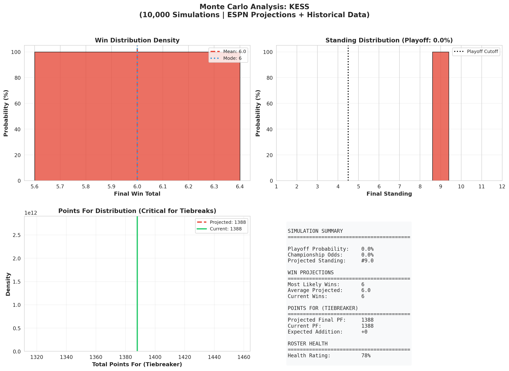

---

### #10 ROUX - Power Score: 20.36

**Record:** 5-10 | **PPG:** 94.06 | **Total PF:** 1411 | **Top6:** 5 | **MVP-W:** 5.36 | **WAX:** -0.36

At #10 with 5-10, the season hasn't gone as planned. Averaging 94.06 PPG with only 5 top-6 finishes in 15 weeks. 

**Projection Summary:** Most likely finish: **5 wins** | Projected PF: **1411** | Playoff: **0.0%** | #1 Seed: **0.0%** 

*The computer ran 10,000 simulations and found essentially no path to the playoffs. Time to play spoiler. 2 starter(s) dealing with injuries adds some variance (1.08x) to these projections. Only 0.0 more projected wins suggests a rough finish ahead.* 

**Roster Health & Availability Report:** 
2 minor injury(s) in lineup. 

*Injured Starters (2):* 
- **Quentin Johnston** (RB, QUESTIONABLE): 7.7 pts proj, Questionable - assumed to play (historical: 80%+ play rate) 
- **Chris Rodriguez Jr.** (RB, QUESTIONABLE): 7.7 pts proj, Questionable - assumed to play (historical: 80%+ play rate) 

*Monte Carlo Variance Impact:* Roster uncertainty increased simulation variance by **8%**, widening outcome distributions. This means higher upside but also higher downside risk. 

**Lineup Status:** Optimally set - no BYE week or injury substitutions needed.

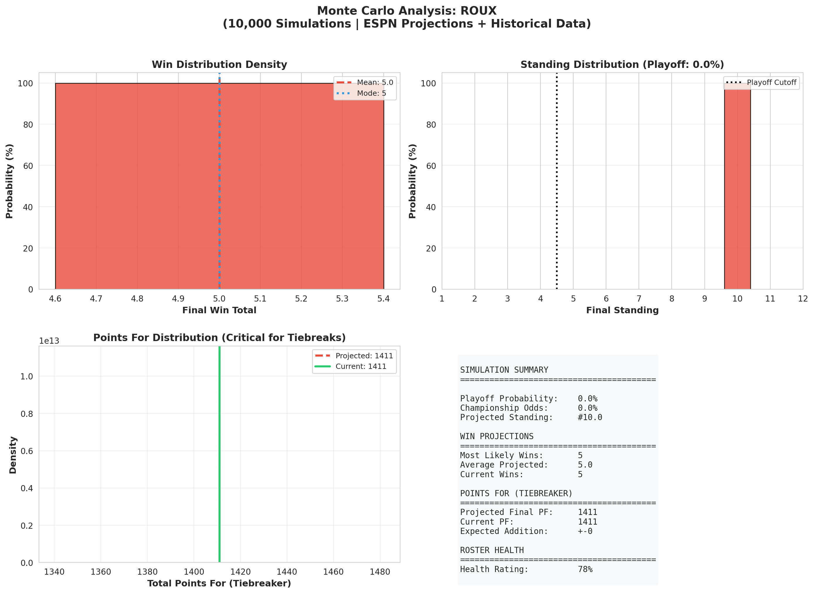

---

### #11 WOOD - Power Score: 19.64

**Record:** 5-10 | **PPG:** 89.02 | **Total PF:** 1335 | **Top6:** 5 | **MVP-W:** 4.64 | **WAX:** +0.36

Bringing up the rear at #11 with a 5-10 record. Their 89.02 PPG ranks near the bottom of the league. Only 5 top-6 finishes in 15 weeks tells the story. With +0.36 WAX, they've actually been a bit lucky - which makes this worse. 

**Projection Summary:** Most likely finish: **5 wins** | Projected PF: **1335** | Playoff: **0.0%** | #1 Seed: **0.0%** 

*The computer ran 10,000 simulations and found essentially no path to the playoffs. Time to play spoiler. Only 0.0 more projected wins suggests a rough finish ahead.* 

**Lineup Status:** Optimally set - no BYE week or injury substitutions needed.

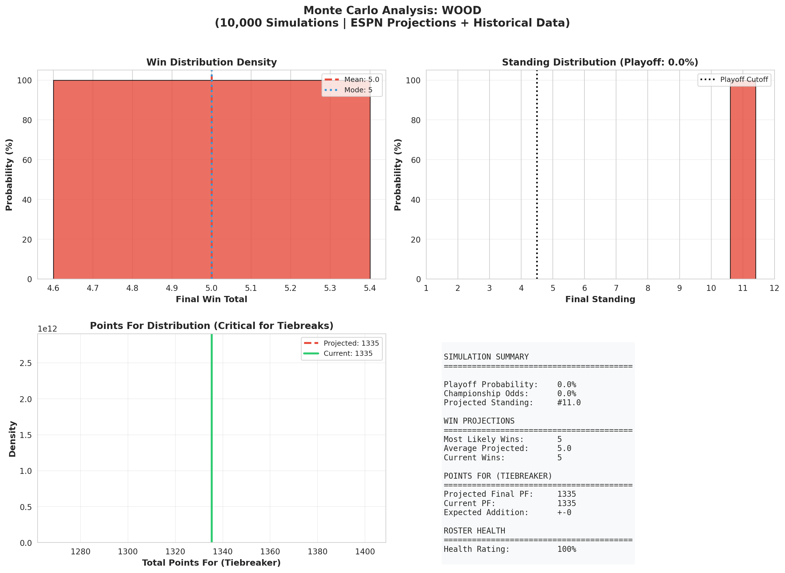

---

### #12 3000 - Power Score: 17.73

**Record:** 4-11 | **PPG:** 92.39 | **Total PF:** 1386 | **Top6:** 4 | **MVP-W:** 5.73 | **WAX:** -1.73

Bringing up the rear at #12 with a 4-11 record. Their 92.39 PPG ranks near the bottom of the league. Only 4 top-6 finishes in 15 weeks tells the story. At least the -1.73 WAX shows they've had some bad luck. 

**Projection Summary:** Most likely finish: **4 wins** | Projected PF: **1386** | Playoff: **0.0%** | #1 Seed: **0.0%** 

*The computer ran 10,000 simulations and found essentially no path to the playoffs. Time to play spoiler. Injuries to Woody Marks (QUESTIONABLE) add unpredictability to the projections. Only 0.0 more projected wins suggests a rough finish ahead.* 

**Roster Health & Availability Report:** 
Key injuries: Woody Marks (RB, QUESTIONABLE). 

*Injured Starters (1):* 
- **Woody Marks** (RB, QUESTIONABLE) ⭐: 13.2 pts proj, Questionable - assumed to play (historical: 80%+ play rate) 

*Monte Carlo Variance Impact:* Roster uncertainty increased simulation variance by **7%**, widening outcome distributions. This means higher upside but also higher downside risk. 

**Lineup Status:** Optimally set - no BYE week or injury substitutions needed.

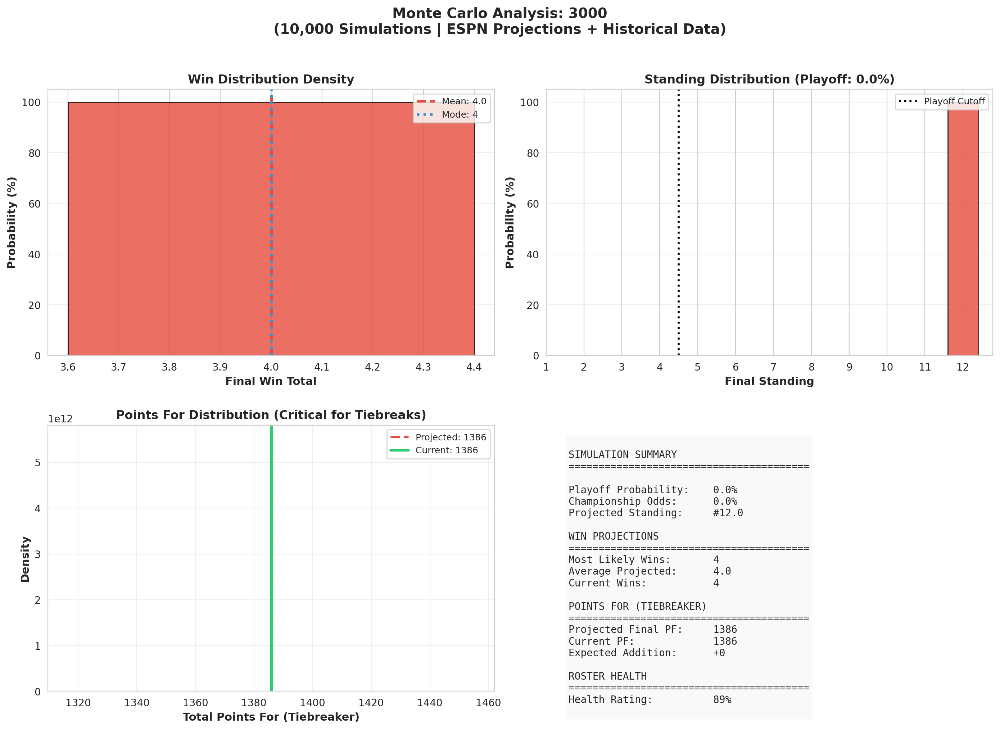

---

## Predicted Final Standings

Based on Monte Carlo simulation with ESPN projections and historical performance:

| Rank | Team | Projected Wins | Projected PF | Current Record | Playoff % |
|------|------|----------------|--------------|----------------|-----------|
| 1 | ZSF | 10.0 | 1806 | 10-5 | 100.0% |
| 2 | KIRK | 10.0 | 1633 | 10-5 | 100.0% |
| 3 | GV | 10.0 | 1580 | 10-5 | 100.0% |
| 4 | MP | 9.0 | 1727 | 9-6 | 100.0% |
| 5 | sgf | 9.0 | 1622 | 9-6 | 0.0% |
| 6 | POO | 9.0 | 1613 | 9-6 | 0.0% |
| 7 | GEMP | 7.0 | 1463 | 7-8 | 0.0% |
| 8 | PATS | 6.0 | 1618 | 6-9 | 0.0% |
| 9 | KESS | 6.0 | 1388 | 6-9 | 0.0% |
| 10 | ROUX | 5.0 | 1411 | 5-10 | 0.0% |
| 11 | WOOD | 5.0 | 1335 | 5-10 | 0.0% |
| 12 | 3000 | 4.0 | 1386 | 4-11 | 0.0% |

---

## Projected Playoff Matchups

*If playoffs started today (top 4 make it, seeded by record then Points For):*

**Semifinal 1:** #1 ZSF (Proj. PF: 1806) vs #4 MP (Proj. PF: 1727)

**Semifinal 2:** #2 KIRK (Proj. PF: 1633) vs #3 GV (Proj. PF: 1580)

---

## Data Sources & Methodology

| Component | Source | Weight |
|-----------|--------|--------|
| Weekly Projections | ESPN Fantasy API | 60% |
| Historical Performance | Season-to-date PPG | 40% |
| Scoring Variance | Season standard deviation | Adjusted for injuries |
| Roster Health | ESPN Injury Designations | Increases variance |
| Tiebreaker | Total Points For | League Setting |

---

*Analysis generated by ESPN Fantasy Football Scraper using 10,000 Monte Carlo simulations. May your players stay healthy and your opponents' stars have bye weeks.*
